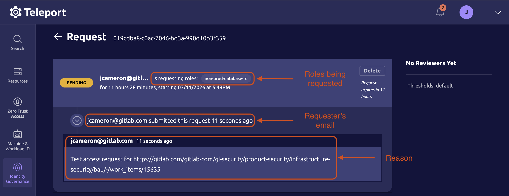

# Teleport Approver Workflow

> [!note] Read-only access
>
> This process is typically grants read-only access. Refer to the
> [change request process](https://handbook.gitlab.com/handbook/engineering/infrastructure-platforms/change-management/#does-my-change-need-a-change-request)
> if read/write access is required.

This workflow outlines the process to review Teleport access requests. It
applies to all forms of read-only access facilitated by Teleport, including the
Rails console and database access.

## Prerequisites

- You are a people manager in the Engineering or Security departments, or have
  otherwise been granted a Teleport approver role.
- Teleport access via Okta (see [getting access](./getting_access.md)).
- (optional) `tsh` is installed (see [installation instructions](./getting_access.md#install-tsh)).

## Who can approve access requests?

> [!warning] Access during a production incident
>
> If urgent access is required during a production incident, ping `@sre-oncall`
> for approval (**only during production incidents**).

Requests are generally reviewed by the requester's direct manager. If their
manager is unavailable, the request may be forwarded to the
[#eng-managers](https://gitlab.enterprise.slack.com/archives/CU4RJDQTY) channel
for review by any available engineering manager.

**Read-write access requests typically cannot be approved by engineering managers.**
Please review the [change management process](https://handbook.gitlab.com/handbook/engineering/infrastructure-platforms/change-management/#does-my-change-need-a-change-request)
to determine whether a change request is required, and reach out to an SRE or
DBRE for assistance.

| Environment | Access type | Approvers                                                          |
| ----------- | ----------- | ------------------------------------------------------------------ |
| Non-prod    | Read-only   | N/A - approval not required                                        |
| Non-prod    | Read/write  | SREs/DBREs                                                         |
| Prod        | Read-only   | People managers in the Engineering or Security departments         |
| Prod        | Read/write  | SREs/DBREs                                                         |

### CustomersDot

Engineering managers in the Monetization group (Fulfilment & Growth) are also
able to approve read/write access to customers.gitlab.com infrastructure (aka
CustomersDot), but **may only do so when the change will impact a single
customer (no bulk changes)**.

For more information on this use-case, refer to the
[customers-gitlab-com repository](https://gitlab.com/gitlab-org/customers-gitlab-com/-/blob/main/doc/setup/teleport.md).

## Process

> [!warning] Security compliance requirement
>
> Help GitLab remain secure and compliant by carefully following this process.
> Failure to do so may lead to an incomplete audit trail, which could result in
> negative findings during a compliance audit. Thank you for your assistance.
>
> If you have any questions please reach out in [#security_help](https://gitlab.enterprise.slack.com/archives/C094L6F5D2A).

This process is typically initiated when a requester tags you in the
[#teleport-requests](https://gitlab.enterprise.slack.com/archives/C06Q2JK3YPM)
channel, or asks you directly to approve an access request.

1. Log into Teleport via Okta SSO at <https://production.teleport.gitlab.net>.
2. In the left-hand sidebar, navigate to **Identity Governance** > **Access
   Requests**. Alternatively, you may click the link in
   [#teleport-requests](https://gitlab.enterprise.slack.com/archives/C06Q2JK3YPM)
   to jump directly to the request.
3. Identify the requester's pending access request and click **View**.
4. Follow the [review checklist](#review-checklist) below to determine whether
   the request meets security & compliance requirements.
5. If each checklist requirement is met, select **Approve short-term access**,
    otherwise select **Reject request**. You may optionally provide a short
   message with your reasoning
6. Click **Submit Review**.
7. The Slack bot in the
   [#teleport-requests](https://gitlab.enterprise.slack.com/archives/C06Q2JK3YPM)
   channel will automatically notify the requester.

### Review checklist

> [!tip]
>
> You do not need to verify the requester's identity. All access requests are
> authenticated via Okta and restricted to GitLab team members.

- The **reason** field contains a **permanent** link (usually to a GitLab issue)
- The issue linked in the **reason** field explains **why** the access request
  is required at this point in time
- The issue linked in the **reason** field explains **what** the requester
  intends to use the access for
- As an approver, use your judgement to determine whether the roles or resources
  being requested are appropriate and align with the the issue linked in the
  **reason** field.



### (Optional) CLI workflow

Approvals can be done entirely through the web interface,
but there are times when it may be desirable to do them from the CLI.

```bash
tsh login --proxy=production.teleport.gitlab.net # Log into Teleport
tsh request ls                                   # List pending access requests
tsh request show <request_id>                    # Show the details of a request
tsh request review <request_id>                  # Review a request
```

## Next Steps

- Access requests are temporary and expire after 12 hours, but may be used
  across multiple sessions. They may be renewed before or after expiration using
  the same request process.
- [Read about access requests](https://goteleport.com/docs/identity-governance/access-requests/)
  in Teleport's docs.

## Support

- For help with Teleport or the approval process, ask in
  [#security_help](https://gitlab.enterprise.slack.com/archives/C094L6F5D2A).
- To report a Teleport bug, [open an issue](https://gitlab.com/gitlab-com/gl-security/product-security/product-security-engagements/product-security-requests/-/issues/new?description_template=infrasec-teleport)
  with Infrastructure Security.

## Troubleshooting

### Credentials expired

If you see the following errors:

`ERROR: your credentials have expired, please login using tsh login`

`ERROR: lstat /private/var/lib/teleport: no such file or directory`

It's likely that you need to log in or re-authenticate with:

```shell
tsh login --proxy=production.teleport.gitlab.net
```

### User Issues

Many user issues can be corrected by removing their local `~/.tsh` directory. It
will be re-created on next login. These problems usually show up if the user has
previously connected to an instance which has been rebuilt and has new CA
certificates.

There are also times when restarting the Teleport service has resolved user
issues. Read about that in the [teleport_admin](teleport_admin.md) runbook.
