# Incident Diagnosis in a Symptom-based World

This guide aims to provide some tools to help answer the question: Something's broken. _What and why?_

## Overview

The general drill-down methodology presented in this guide follows these steps:

- Architecture: Where am I in the stack?
- Impact: How are users impacted?
- Changes: What changed recently?
- Component: Which service component is affected?
- Traffic: What do these requests have in common?
- Service Attribution: Which service dependency is affected?
- Tracing: Which calls are being made to the dependency?
- Contention: Which resource is contended?
- Profiling: Who is consuming that resource?

## Context

The environment we are working in is a distributed system with many components. This guide is aimed at SREs working within such a system, holding the pager and having to respond to incidents.

It's written within the context of GitLab.com, the methodology can be applied more broadly though.

## Symptom- vs cause-based alerting

There are generally two schools of thought when it comes to alerting: Symptom- and cause-based.

Cause-based alerting monitors for indicators of specific problems. This often includes system-internal metrics, such as machine resources (CPU, memory, disk, network). Or it could be checking for bad states that have occurred in prior incidents, for example, if a prior incident involved filesystem permission problems, there could be an alert that checks and verifies correctness of the permissions.

Symptom-based alerting looks at the system from a user's perspective. The two most common signals here are errors and latency. _Is it working and is it fast (enough)?_

We call these error SLO and apdex SLO.

### Trade-offs for cause-based alerting

Pro:

- Tells you _why_ something is broken, not just what.
- Leading indicator, it can anticipate problems.

Con:

- Can be very noisy. A saturated resource may or may not actually cause problems for the user.
- Less resilient to system and workload changes, which drives false alarms and alert fatigue.

### Trade-offs for symptom-based alerting

Pro:

- Strong signal-to-noise ratio. If you get alerted, it's likely legit.
- General. You can apply the same framework across many services.

Con:

- Lagging indicator. Once you get the alert, it's often already too late.
- Diagnosis is harder. We need to trace from symptom to cause.

See also the Google SRE Book: [Symptoms Versus Causes](https://sre.google/sre-book/monitoring-distributed-systems/#symptoms-versus-causes-g0sEi4), [The Four Golden Signals](https://sre.google/sre-book/monitoring-distributed-systems/#xref_monitoring_golden-signals).

### Why not both?

The approaches are not mutually exclusive. We generally lean towards symptom-based monitoring for short-term alerting because of the superior signal-to-noise ratio.

We use resource-based alerting for capacity planning purposes, see [Tamland](https://gitlab.com/gitlab-com/gl-infra/tamland), as well as on some database nodes, where we lack autoscaling and saturation is very likely to be user impacting, for example [Redis](https://gitlab.com/gitlab-com/runbooks/-/blob/eb0e9b502be57d59676af361861d180d8147565a/libsonnet/saturation-monitoring/redis_primary_cpu.libsonnet#L6).

## I got paged for an apdex issue, now what?

Diagnosing from symptoms can be daunting at first. The alert simply says "something's broken" or "something's slow", without much help as to what might be the matter.

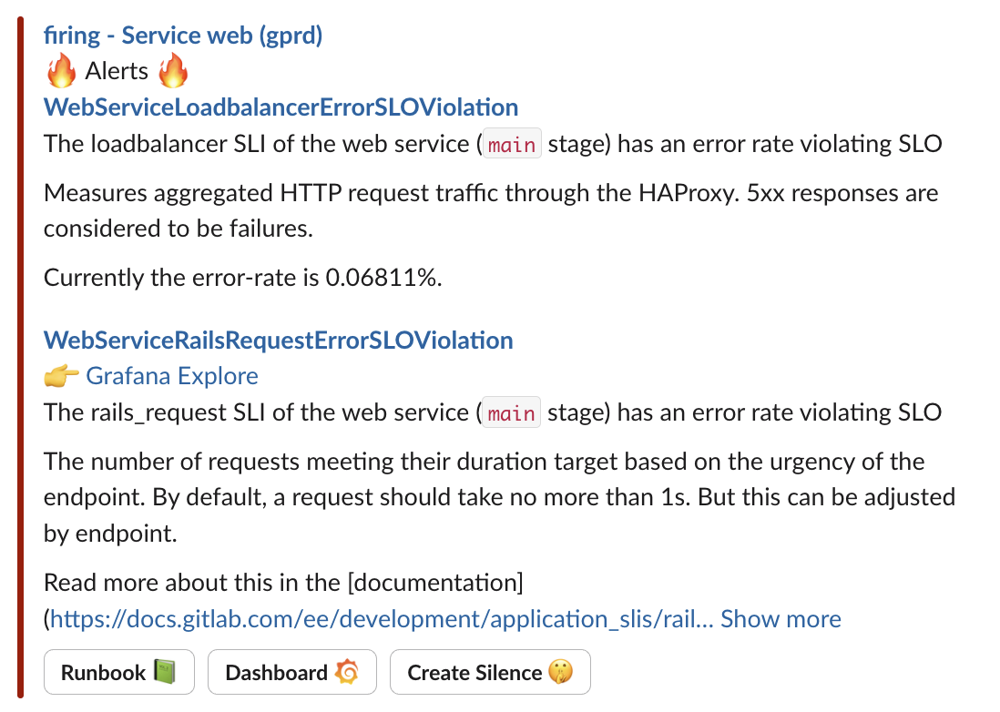

### Where am I in the stack?

The first thing to consider with such an alert (or series of alerts) is: which service is complaining, and how does this service fit into the overall system architecture?

Architectural questions include:

- Who are the clients?
- Who are the dependencies? (upstream services, databases)
- How do the services talk to each other?
- Is the service stateful?
- Where is it deployed?

This context is important for isolating common dependencies when getting paged for multiple services at the same time, understanding the user impact, and diagnosing the issue further.

We have a very high-level diagram for [GitLab.com Production Architecture](https://handbook.gitlab.com/handbook/engineering/infrastructure-platforms/production/architecture/#gitlab-com-architecture) that answers some, but not all of these:

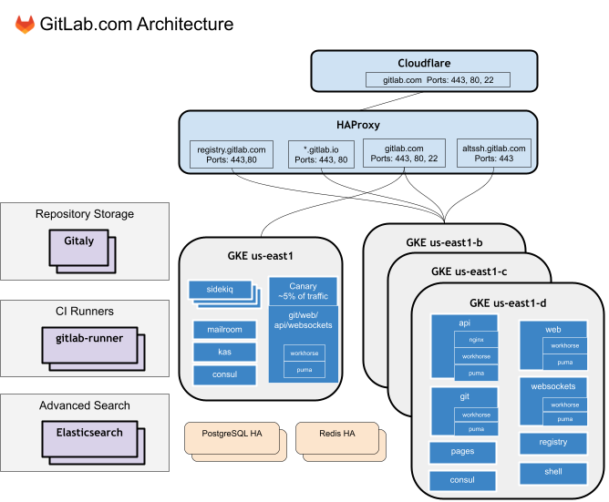

Service-specific diagrams can describe service interactions in more detail. Here is an example [from Gitaly](https://docs.gitlab.com/administration/gitaly/#gitaly-architecture):

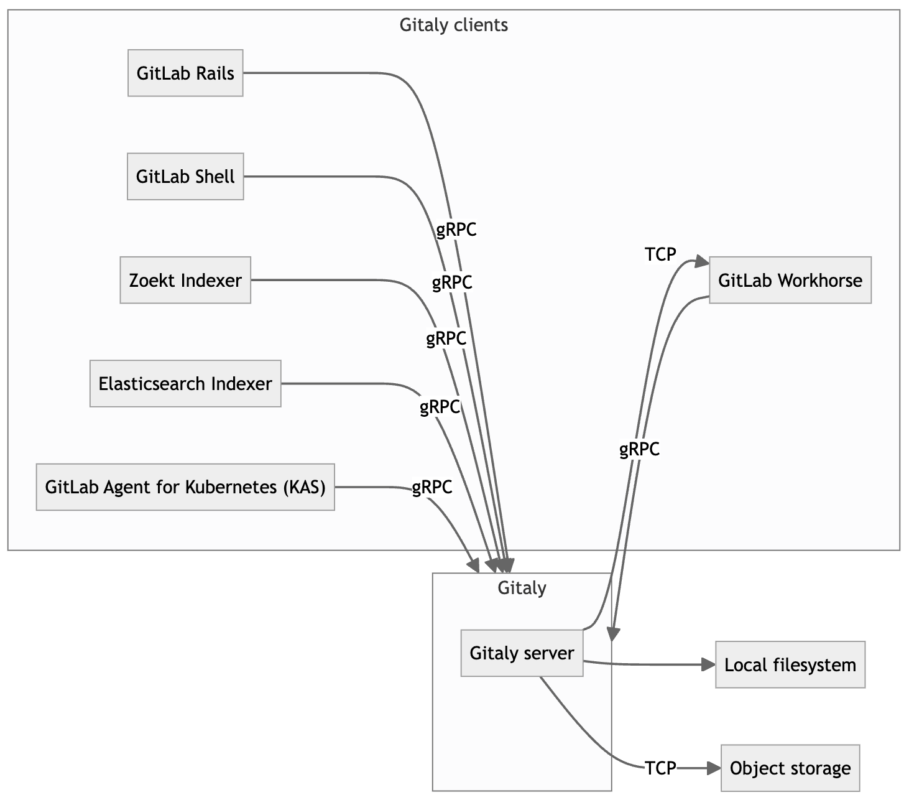

When there are alerts for several services at the same time, this is usually a signal that a piece of shared infrastructure is broken, e.g. a database, a broader cloud provider or networking issue, or even the monitoring system itself.

### Assessing impact

Symptom-based alerts will most of the time signal that there is an ongoing impact. In order to assess the urgency of response, it's important to get a high-level understanding of the impact. This informs incident severity and also helps drive customer communication.

We don't need to be super precise here, no need for exact customer counts or such, that can be done later. The most important classifications are:

- Is this a major event? (e.g. full outage, data loss, these will become sev 1)
- Is the impact ongoing? Many events are short-lived.
- Is the impact customer-facing or internal-only?
- Is the impact significantly degrading or disrupting user experience?

To understand this impact, we look at the clients of the system.  We start by looking at the service dashboard, for example [web: overview](https://dashboards.gitlab.net/d/web-main/web-overview?orgId=1).

We may combine this with anecdotal evidence from reproducers or customer reports. This is particularly important for cases where there are monitoring gaps and the SLIs don't show the impact.

## Drill-down methodology

Next up, we need to diagnose the problem. The initial goal is not to fully understand the problem. It is to understand the problem well enough in order to apply mitigations.

Once we have identified a mitigation path, we should always pursue the mitigation first before continuing to dig deeper. During an incident, every second counts. We can always dig more later.

If there is a viable mitigation path early on, it should be pursued even before assessing impact.

### Basic time- and event-based correlation

An easy one to check first is: _What changed?_

Recent deploy? Roll back. Feature flag? Turn off. Were any infra-level changes rolled out recently? Revert.

These are usually so easy to do that they should be complete no-brainers.

For GitLab.com we surface these events via Grafana annotations ("deploy markers") and via the [production events index](../pd-event-logger-7760xa/events.md).

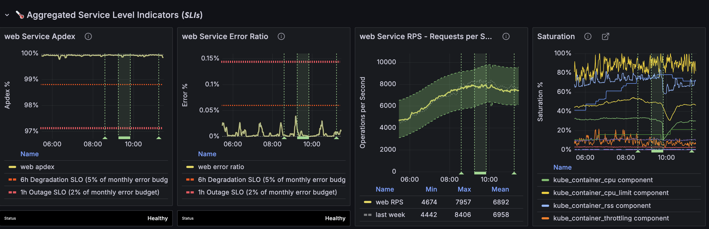

### From top-level metrics to components

Alerting is very high-level. We get alerted for the `web` service, but we don't know which part is affected.

The top-level SLIs are composed of various component SLIs. Components may include proxy layers or vertical slices of the service's traffic.

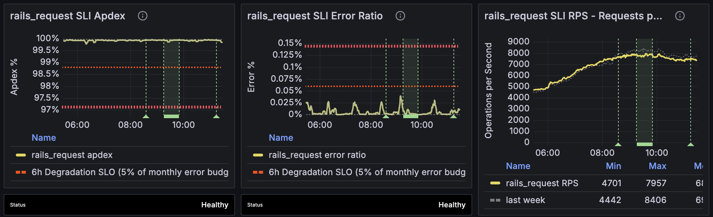

There is often a small set of "heavy hitter" SLIs that absorb most of the service's traffic. For webservices (`api`, `git`, `web`) those are usually `workhorse` (proxy receives all traffic) and `rails` (receives bulk of heavy traffic from workhorse).

We can also look at a high-level breakdown along dimensions such as `endpoint_id` or `feature_category`, surfaced via `SLI Detail` panes.

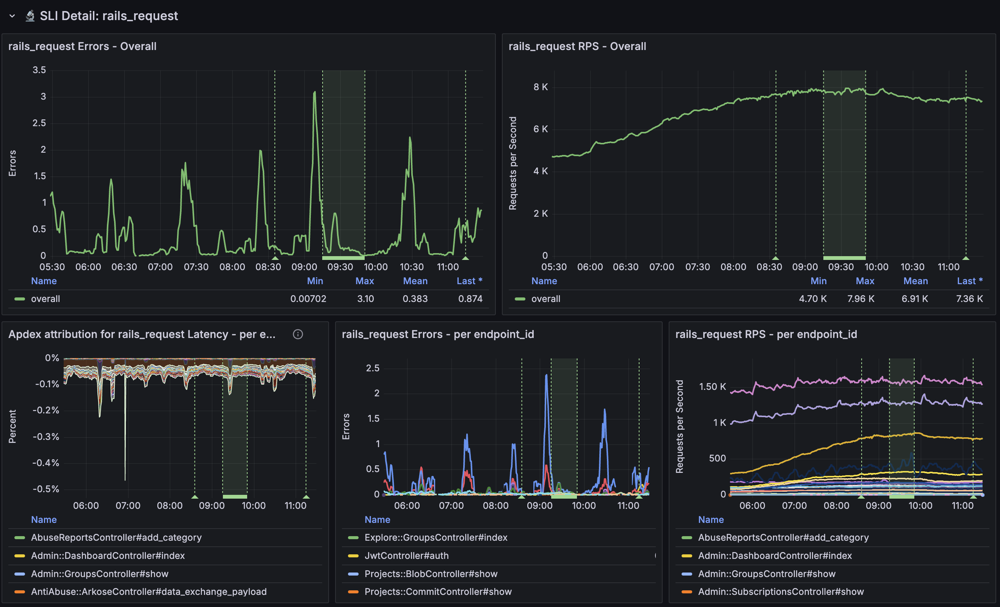

This can give us a general direction and tell us which logs to look at for more fine-grained analysis.

### From metrics to logs

Metrics work well until they don't, the main challenge is cardinality. Diagnosing incidents very often requires aggregating events by high-cardinality fields. We do that via (structured) logs.

The log data consists of events that tell us about both the request and the response, as well as other context from the execution of a request. We have fields for client ip address, logged in username, http information, how long the server spent on various parts of the response generation. This follows the [canonical log lines](https://brandur.org/canonical-log-lines) concept.

Coming from metrics, the first step is constructing a log query that matches the metrics query of the SLI. In practice that means applying filters for service, component, latency thresholds, error signals. Our dashboards have per-component links that provide such a query:

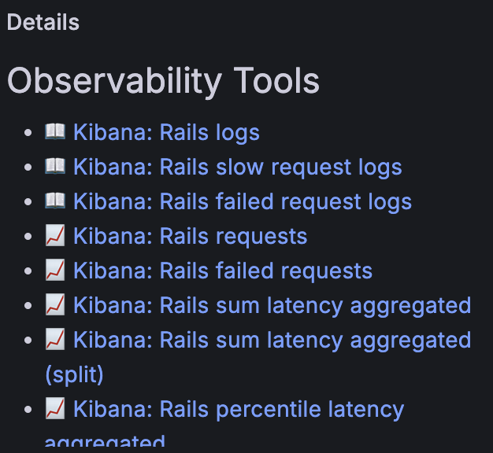

These links go directly to Kibana, with appropriate apdex or error conditions pre-selected for slow vs failed requests, respectively.

With this new tool in hand, we can start asking questions about this data.

### Querying: filtering and grouping

The ultimate question at this stage is: _What do these requests have in common?_

The fundamental query model for most log analysis is this:

```
SELECT agg(<field>)
  FROM logs
  WHERE <condition>
  GROUP BY <dimension>
```

To identify candidates, we can look at the distribution of values for fields of interest. We already have a pre-selected set of filters that show the "problematic" traffic, that is, errored or slow requests. Clicking on the fields gives a histogram. If there are  heavy hitters, this is a strong indication of that dimension being a factor.

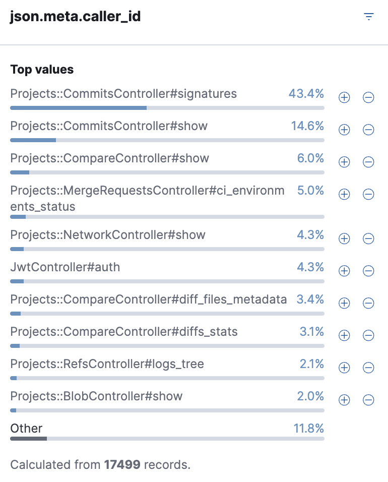

Dimensions of interest include things like:

- User identity: Username, client IP
- User context: Group, Project
- Feature or product area: Controller, Feature category
- Infrastructure: Zone, Node, Pod

We can use group-by and filter to compare the distribution with the overall population (broken traffic vs all traffic) to make sure that it actually correlates with the problem and is not just a case of "our largest customer".

One method for performing group-by is via the breakdown option in Kibana, which shows distribution over time:

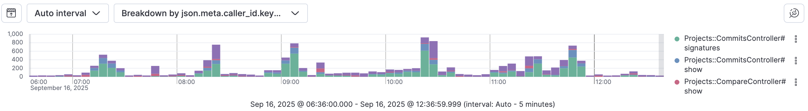

At this stage we may identify a bad user and opt to mitigate by applying rate limits at the edge. Or a bad pod that needs to be restarted. Or a feature that needs to be disabled.

### Dependency attribution

Often when a service is having a bad time, it's related to one of its dependencies.

For example, `web` talks to `patroni` (various patroni clusters in fact, and a layer of `pgbouncer` in between), `redis` (various redis clusters in fact), `gitaly`, `elasticsearch`, and many others.

In order to determine whether the problem for a slow `web` request was in `web` itself or upstream, we can use per-request instrumentation. By measuring how much time we spend in each dependency, we can give a per-request accounting of where the time was spent.

This is emitted in logs via fields like `duration_s`, `db_duration_s`, `redis_duration_s`, `gitaly_duration_s`, etc. That should give an idea of who we were waiting for. Similarly, if there was an error while talking to a `gitaly` node, the request logs will tell us what kind of error, and on which node. Conversely, `cpu_s` accounts for CPU time spent in `web` itself.

This information can be viewed on a per-request basis, or in aggregate. Here is an example of a few slow `web` requests:

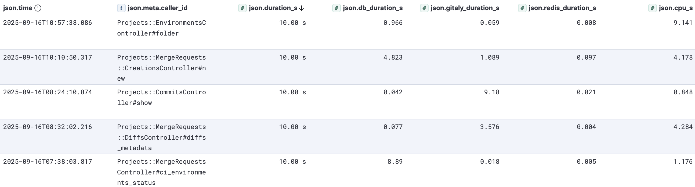

There are several sources of latency here. Looking at these individual requests:

1. 10 seconds total, 1 of which was spent in postgres, the remaining 9 within `web`.
1. 10 seconds total, 5 in postgres, 1 in gitaly, 4 in `web`.
1. 10 seconds total, 9 in gitaly, 1 in `web`.
1. 10 seconds total, 3.5 in gitaly, 4 in `web`, 2.5 unaccounted for.
1. 10 seconds total, 9 in postgres, 1 in `web`.

In this particular case it is a pretty wide composition of latency sources. During incidents there will often be common themes that point towards a particular dependency being under pressure.

### Aggregation

The histogram and breakdown features in Kibana cover the most common use cases, but come with some important caveats:

- Histogram only provides top-10 most frequent values and can be inaccurate on large datasets due to sampling.
- Breakdown only provides top-3 most frequent values and groups the rest in "other".

The main motivation for more flexible querying and aggregation is:

- Expand top-k beyond 10
- Change the Y-axis from sum of request count to something else, for example:
  - Sum of request duration over time, grouped by controller
  - Sum of dependency durations over time
  - P99 latency
  - Sum of dependency call count over time

For more flexible querying we can use the visualization links from Observability Tools. Here is an example aggregation of sum latency over time:

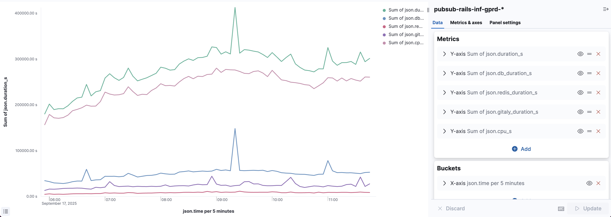

Here we can see at a glance that the bulk of the request duration is attributable to `cpu_s`, with Postgres and Gitaly as runners-up, contributing bursts of latency.

This aggregation view provides a similar experience to Prometheus querying, but with much more flexibility. Since we're operating on the raw log data, we can filter and group by high-cardinality fields.

### Navigating dependencies

Now we know which service to look at next. We can go to the dashboard for this dependency and perform the same top-down analysis from scratch, but it may be the case that the overall service is healthy, and it's simply a subset of requests that are having trouble.

This is where tracing comes in. We have a `correlation_id` that is generated at the edge and threaded through the entire system. Every time we cross a request or system boundary, we propagate this id. Every time we emit a log, we include it. It is even included in postgres logs. And we also print it on 5xx errors.

As a result, we can follow the request from `web` to the services it called into, such as `gitaly`. We can see exactly which RPCs were made, how long they took, their arguments, and more detailed information about the calls themselves.

We do this via the [correlation dashboard](https://log.gprd.gitlab.net/app/dashboards#/view/AWfFGg4H5VFy3_25mrdc). By extracing the `correlation_id` from the request in question and plugging it into the dashboard, we can see all related calls. Here's an example of the gitaly calls for the previous example where 9 seconds were spent in gitaly:

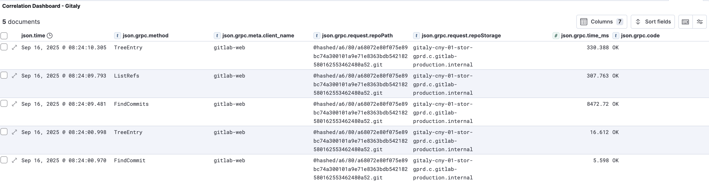

This is especially useful for rare or more localised events. For example, someone may be reporting a single page that is loading slowly or erroring, without the overall SLIs being affected, and without the issue being reproducible. By getting a `correlation_id`, we can see the events in question.

> [!note]
> This is a rather basic form of distributed tracing. There are dedicated tracing systems such as Jaeger that can present this (and even more granular) information in a more intuitive Gantt chart. [At time of writing, we do not have such a system available for GitLab.com](https://gitlab.com/groups/gitlab-com/gl-infra/-/epics/1517).

## Resource-based analysis

So far we have mostly relied on correlation based on observed effects. In many cases this is enough. Rate-limit the bad traffic, done.

There may be issues where the causal chain is evident, e.g. a crash or exception. Revert the commit, done.

But we often deal with another class. The truly hard problems to diagnose are performance problems at scale. To tackle these, we need to think about things differently. We need a resource-based (mental) model.

The services we run require resources, we can separate these into logical vs physical.

### Logical resources

The most basic logical resource is a lock (mutex). It guards access to some region of code. Then, there are higher-level logical resources that are built on top of locks.

The most pervasive higher-level resources are pools and queues. They're everywhere.

Pools are usually a proxy for an underlying set of (physical) resources. Pools allow those resources to be shared by consumers while guarding the concurrency level. They are often fronted by a queue which will absorb excess load.

Overload of the pool will surface as time spent waiting in the queue. The premise of this setup is often: It's better to handle a subset of the load fully and queue/drop incoming requests than to completely stop completing work (i.e. graceful degradation). This also enables isolation by creating separate pools per workload.

We see this pattern everywhere: Kubernetes node pools, pgbouncer backend pools, puma thread pools, connection pools, sidekiq shards, goroutines, haproxy backends, etc.

Where this is possible, we model resources as utilization metrics showing a utilization percentage that goes up to 100%, at which point the resource is saturated and new work will be queued or rejected. These metrics are on the saturation panel on the top right of the service dashboard.

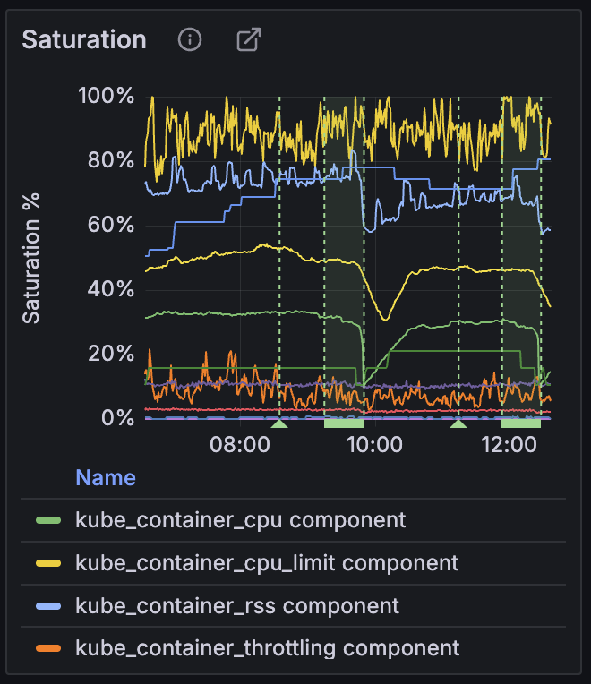

> [!note]
> The presence of queues often makes it difficult to tell the difference between consuming the resource vs waiting for the resource. From the callers' perspective these two cases often look the same.

### Physical resources

While our cloud providers hide a lot of the gnarly details, we are still running on physical hardware, and we must obey the laws of physics.

We run on silicon: CPUs, RAM, network, SSDs. While we cannot observe this hardware directly, the OS gives us a pretty decent view of what is going on. In Kubernetes the abstraction for these would be a pod, but the more accurate representation is at the node level.

These physical resources often degrade in ungraceful ways when their capacity is exceeded. CPU will queue runnable threads on a runq, they will need to wait their turn. Memory will swap to disk, degrading performance, or the OOM killer will kill the process.

> [!note]
> This ungraceful degradation is often the cause of performance problems. Understanding which resource is contended tells us where we either need to increase capacity or lower demand.

Most of these resources can be seen on the [host stats dashboard](https://dashboards.gitlab.net/d/bd2Kl9Imk/host-stats). Some services may also have their own per-host dashboards, for example [Gitaly's host detail dashboard](https://dashboards.gitlab.net/d/gitaly-host-detail/gitaly3a-host-detail).

Here is a CPU utilization graph from a gitaly node from host stats:

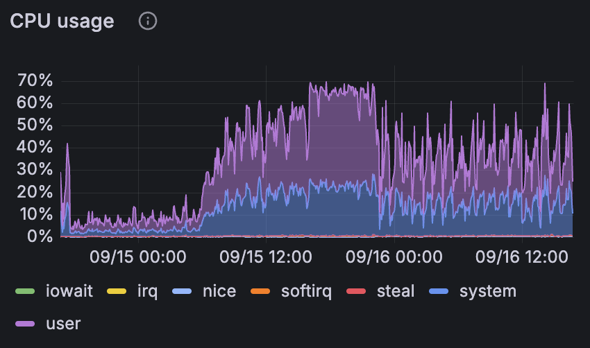

The CPU utilization did not reach 100%. However, if we look at the Gitaly host detail dashboard, we find that CPU was throttled at the cgroup level:

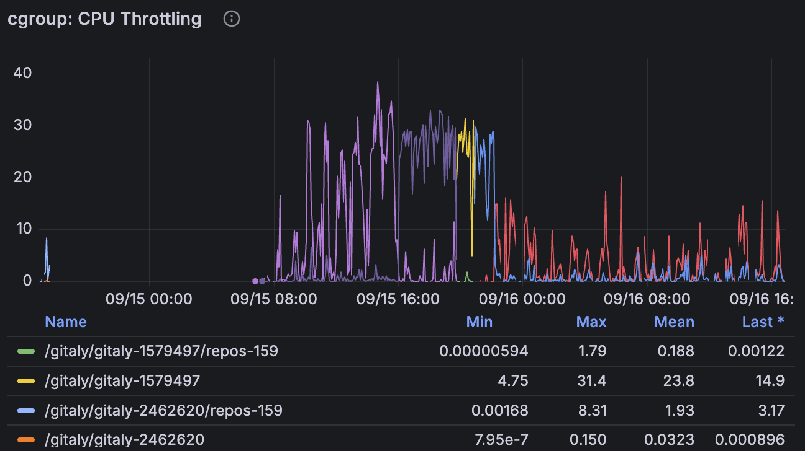

This is an example of a logical resource (the cgroup) imposing a cap on how much of the underlying physical resource can be consumed. The physical resource is not saturated, but callers of the service are still impacted due to the logical resource saturation.

### Feedback loops

Resources are not independent, there are many feedback loops where one resource will influence another.

A classic example is autoscaling. Most workloads will scale based on CPU utilization:

- We set a target CPU utilization percentage. When we are above target, add capacity. When we are below target, remove capacity.
- An increase in CPU utilization will trigger the [Kubernetes HPA](https://kubernetes.io/docs/tasks/run-application/horizontal-pod-autoscale/) to give the `Deployment` more pods.
  - This brings CPU utilization down, but increases HPA utilization (percentage of max pods).
- If no space is available for the new pods, the node autoscaler will provision a new node.
  - This increases the node pool utilization (percentage of max nodes).

### Databases

Stateful services tend to be contention points of a distributed system. This is because they cannot be horizontally scaled as easily as stateless services.

Thus the approach of adding more capacity, i.e. "throw money at the problem" is often not tenable. That makes diagnosing and resolving database problems difficult but also crucial. It is in those cases specifically where understanding which resources are being contended on and by whom is so important.

Often database-specific expertise is needed to properly diagnose these problems. Do not hesitate to escalate to subject matter experts when dealing with an issue involving Postgres, Redis, Gitaly, Elasticsearch.

Resource-based analysis can go a long way in diagnosing, but it will often be insufficient to fully resolve incidents in stateful services.

### Profiling

If we want to understand and potentially optimize the workload, we need to know who is using the resources (which process, which code paths). In other words: to attribute the resource demand, we need to measure resource consumption.

In some cases it's possible to measure this consumption in an attributable way directly. For example, Gitaly shells out to `git`, we can collect `rusage` when the process exits (the Gitaly logs and metrics include this). In rails, puma workers get their own OS thread, so we can get CPU time spent at the end of each request (rails log include this).

In many cases this direct measurement is not possible though. In these cases we must observe indirectly. A common tool for this is profiling. Sampling CPU profilers in particular are an excellent tool for understanding which code paths are hot. An effective visualization for CPU profiles is a [Flame Graph](https://www.brendangregg.com/flamegraphs.html).

Here is a flamegraph from a Gitaly node, filtered down to the `git` processes:

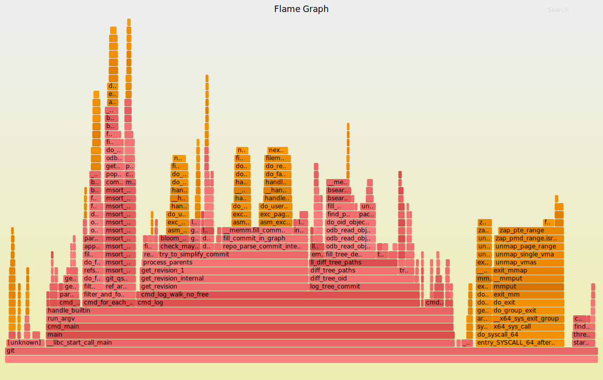

It shows that the most expensive git subcommand was `git log`, with 50% of cycles being spent in the kernel handling page faults. This could point towards an ineffective page cache or a workload targeting cold repos.

We have several profilers at our disposal. Linux has a built-in sampling CPU profiler called `perf`, that can be run via [VM scripts](how_to_use_flamegraphs_for_perf_profiling.md) or [GKE scripts](..//kube/k8s-adhoc-observability.md). Go's pprof has both CPU and memory sampling ([gitaly](../gitaly/gitaly-profiling.md#gitaly-process)). Same goes for Ruby's [stackprof](../uncategorized/ruby-profiling.md#stackprof).

For more advanced techniques, see:

- [Brendan Gregg -- Systems Performance](https://www.brendangregg.com/books.html)
- [Richard L. Sites -- Understanding Software Dynamics](https://www.oreilly.com/library/view/understanding-software-dynamics/9780137589692/)

## Summary

Diagnosing problems in production is hard. Especially in a symptom-based alerting environment where the initial problem description is very vague.

With drill-down analysis, we have a powerful tool to navigate these uncertain waters. By using observations at various levels of granularity we can correlate, make hypotheses, refute them.

This has been a relatively high-level overview. Hopefully it's given you some new ideas for how to approach that next incident.

Channel that Dr. House. Not too much though.
