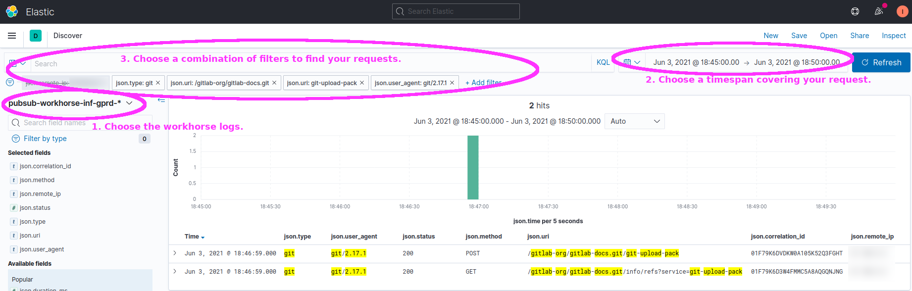
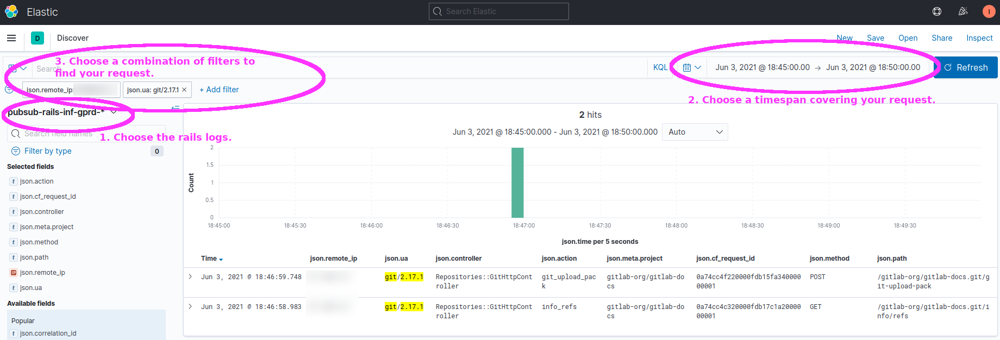
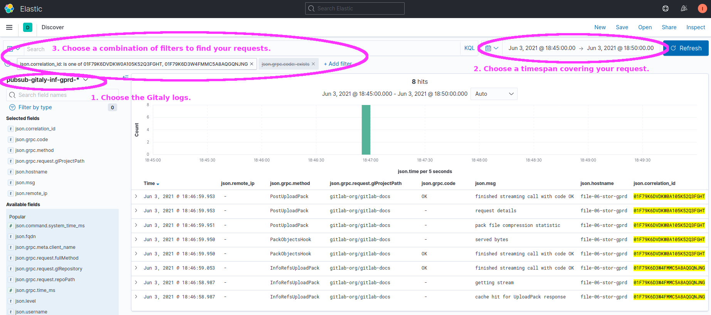

# Life of a Git Request

## Learning objectives

* Learn which application and infrastructure components are involved in handling `git` requests.
* Learn how the call paths differ depending on whether the client is using SSH or HTTPS as their secure transport protocol.
* Learn how to observe git requests using Kibana to find related log events.

Readers are assumed to have a basic familiarity with Git.  You should know what a git repository is, that `git clone` makes a local copy
of that repo, and that `git fetch` refreshes that local copy.

This tutorial does not cover the internal details of how Gitaly and `git` perform these tasks.  Here we just outline the series of service
calls and demonstrate how to observe those service calls through the logging infrastructure specific to GitLab.com.

As an added benefit, learning how to observe these interactions via client-side tracing and server-side logs may help you
explore git protocol details, such as how `git clone` and `git fetch` work by asking the server for an inventory of refs,
comparing that to what is already stored locally, and then asking the server to send whichever objects are locally missing.

## Introduction

This tutorial traces a few common `git` commands (e.g. `git clone`) through the GitLab.com infrastructure, contrasting Git-over-SSH and Git-over-HTTP.
Other git operations follow the same paths and can be traced in the same way.

Depending on whether the client cloned the git repo using SSH or HTTPS, the subsequent git operations will take a different path through
the GitLab infrastructure but ultimately arrive at the same place (Gitaly) and produce the same outcome for the end-user's `git` client.

By learning how to trace a single request, view what characteristics are logged, and filter to find other similar requests, we can:

* troubleshoot unexpected behavior
* identify abnormal changes in request or response characteristics (e.g. huge increase in git-fetch rate for a specific repo from a specific client IP)
* be aware of what is and is not observable with existing metrics, logging, and instrumentation

## Call path between GitLab application components

See the GitLab product documentation, which includes a concise sequence diagram and explanation for both Git-over-HTTP and Git-over-SSH,
illustrating the differences and similarities in these two distinct call paths.

<https://docs.gitlab.com/ee/development/architecture.html#gitlab-git-request-cycle>

The above product documentation covers the relevant application components and their interactions -- the behaviors
that are typical of any GitLab deployment.  The following notes cover additional details specific to the GitLab.com environment:

* The "Git on client" component is the host running the end-user's `git` command, typically a host somewhere on the Internet or in GitLab.com's pool of CI/CD job runners.
* The Workhorse and Rails components run in Kubernetes pods.
  * The HAProxy backends named `https_git` and `ssh` respectively delegate git-over-http and git-over-ssh to autonomous Kubernetes clusters in several zones.
  * Historically, these ran on VMs named `git-XX`, and some documentation still refers to them.
* The Gitaly and "Git on server" components run on hosts named `file-XX`.
  * These VMs are single points of failure for the availability of the repos stored there.
  * We are actively developing a high-availability solution called Praefect that acts as a proxy for calls to Gitaly and coordinates failover between primary and replica Gitaly nodes.
* Several infrastructure components sit between the "Git on client" and the "Workhorse" components.  In order, these include:
  * Cloudflare: Provides DDoS protection, web-application firewall, and security control point.  Acts as a TLS endpoint for HTTPS but just a TCP pass-through for SSH.
  * GCP external load balancer: TCP-layer routing rule that forwards connections to a pool of HAProxy nodes.
  * HAProxy: Routes both Git-over-SSH and Git-over-HTTP requests to one of several Kubernetes clusters.
    * The HAProxy nodes represent the outer edge of our VM-based GCP infrastructure.
    * Like Cloudflare, HAProxy acts as a TLS endpoint for HTTPS and a TCP-passthrough for SSH.
  * Kubernetes: Traffic from HAProxy enters the Kubernetes cluster via a TCP-layer GCP internal load balancer.
    * Traffic between HAProxy and the `gitlab-webservice-git` pods does not use TLS.
    * Unlike the GitLab product documentation linked above, Nginx has been removed from the call chain in the GitLab SaaS infrastructure.
    * Nginx primarily acted as a TLS endpoint between HAProxy and Workhorse, but because network traffic within a GCP VPC is already encrypted, this provided little benefit.
  * At this point (from Workhorse forward), the control flow matches the diagram linked above.

## Demo: Observing an example `git` request

As always, tracing entails peeling back a layer of facade.
We will see a little of Git's internal behavior, but our main focus in this tutorial is to show the observability tools available to you.
You are not expected to understand the inner workings of git.  Just being able to see the discrete phases of a request can aid in troubleshooting a stall or error.

### Client-side view

Normally the daily-use high-level "porcelain" git commands like `git clone` and `git fetch` only output a summary of results, but with tracing enabled,
we can see the series of internal "plumbing" commands that run under the hood.

Note that this form of tracing is not required to see the server-side log events that we will examine next.
These client-side tracing options only affect the verbosity of the client-side output.

Git's built-in tracing is controlled via environment variables.  Especially useful examples:

* Setting `GIT_TRACE=/tmp/git-trace.log` enables general tracing messages, including local and remote execution of built-in git commands.
  * Must use an absolute path for the filename.
  * If the output file exists, new output is appended (not overwritten).
  * Alternately, setting `GIT_TRACE=1` is the same as above, except the trace output goes to standard error and is interleaved with other output.
* Setting `GIT_TRACE_CURL=/tmp/git-curl.log` and `GIT_TRACE_CURL_NO_DATA=1` enables logging HTTP request and response headers for a Git-over-HTTP command.

These and more tracing options are documented in:

* the [git manpage](https://git-scm.com/docs/git#Documentation/git.txt-codeGITTRACEcode) or `man git`
* the [Git source code documentation](https://github.com/git/git/blob/master/Documentation/git.txt)

#### Example of tracing the git client

Let's pick a small repo and clone it while enabling the general-purpose client-side tracing (`GIT_TRACE`).

```shell
# Tip: Setting the TZ environment variable to UTC makes my local shell's timestamps easier to compare to server-side logs, which also use UTC.

$ export TZ=UTC

# Setup git tracing environment variables.

$ export GIT_TRACE=/tmp/git-trace.log
$ export GIT_TRACE_CURL=/tmp/git-trace-curl.log
$ export GIT_TRACE_CURL_NO_DATA=1

# Run git command.

$ git clone https://gitlab.com/gitlab-org/gitlab-docs.git /tmp/git-trace-test
Cloning into '/tmp/git-trace-test'...
remote: Enumerating objects: 5401, done.
remote: Counting objects: 100% (5401/5401), done.
remote: Compressing objects: 100% (1020/1020), done.
remote: Total 16805 (delta 5258), reused 4405 (delta 4380), pack-reused 11404
Receiving objects: 100% (16805/16805), 23.55 MiB | 2.87 MiB/s, done.
Resolving deltas: 100% (11179/11179), done.
```

In addition to the normal output of `git clone`, we can see several interesting things in the trace output.

In the `GIT_TRACE` output:

* We see "built-in" git commands, including both the high-level "clone" and low-level "fetch-pack", "index-pack", and "rev-list".
  * Git implicitly runs the build-in subcommand "fetch-pack" to download a git packfile containing the requested git objects.
  * Then git locally runs "index-pack" to create an index of the objects in that local packfile, and as part of that subcommand,
    it validates integrity of the packfile by making sure all objects referenced by the pack are contained in the pack.
* We also see "run_command" trace output, where our git process creates helper child process, which it typically interacts with via stdin/stdout.
  * In some cases can even include non-git commands like `ssh`, although in this example all of the child processes are helper `git` processes.

```shell
# Review GIT_TRACE output.

$ cat /tmp/git-trace.log
18:46:58.650752 git.c:344               trace: built-in: git clone https://gitlab.com/gitlab-org/gitlab-docs.git /tmp/git-trace-test
18:46:58.684055 run-command.c:646       trace: run_command: git-remote-https origin https://gitlab.com/gitlab-org/gitlab-docs.git
18:46:59.427719 run-command.c:646       trace: run_command: git fetch-pack --stateless-rpc --stdin --lock-pack --thin --check-self-contained-and-connected --cloning https://gitlab.com/gitlab-org/gitlab-docs.git/
18:46:59.430213 git.c:344               trace: built-in: git fetch-pack --stateless-rpc --stdin --lock-pack --thin --check-self-contained-and-connected --cloning https://gitlab.com/gitlab-org/gitlab-docs.git/
18:46:59.912543 run-command.c:646       trace: run_command: git index-pack --stdin -v --fix-thin '--keep=fetch-pack 12304 on saoirse' --check-self-contained-and-connected --pack_header=2,16805
18:46:59.918255 git.c:344               trace: built-in: git index-pack --stdin -v --fix-thin '--keep=fetch-pack 12304 on saoirse' --check-self-contained-and-connected --pack_header=2,16805
18:47:08.465954 run-command.c:646       trace: run_command: git rev-list --objects --stdin --not --all --quiet '--progress=Checking connectivity'
18:47:08.469704 git.c:344               trace: built-in: git rev-list --objects --stdin --not --all --quiet '--progress=Checking connectivity'
```

In the `GIT_TRACE_CURL` output:

* We can see 2 HTTP requests and their responses, both of which were run by the above "git fetch-pack" subcommand.
* The first request (an HTTP GET to the endpoint `info/refs?service=git-upload-pack`) is requesting a list of git refs (branches, etc.).
* The second request (an HTTP POST to the endpoint `<namespace>/<project>.git/git-upload-pack`) is requesting a git packfile containing the
  set of required git objects.
* The HTTP headers in the request and response give us some insights:
  * The "Content-Type" header tells us what git-specific payloads are being sent/received.
  * The "GitLab-LB" and "GitLab-SV" response headers tell us which HAProxy node and backend handled each request.
  * The "cf-request-id" and "CF-RAY" response headers give us a unique id we could lookup in the Cloudflare logs or our own server-side workhorse logs.

```shell
# Review GIT_TRACE_CURL output.

$ wc -l /tmp/git-trace-curl.log
113 /tmp/git-trace-curl.log

# First show just the HTTP request URLs and response codes.

$ cat /tmp/git-trace-curl.log | grep 'header: .*HTTP'
18:46:58.856191 http.c:654              => Send header: GET /gitlab-org/gitlab-docs.git/info/refs?service=git-upload-pack HTTP/1.1
18:46:59.264974 http.c:654              <= Recv header: HTTP/1.1 200 OK
18:46:59.607022 http.c:654              => Send header: POST /gitlab-org/gitlab-docs.git/git-upload-pack HTTP/1.1
18:46:59.909226 http.c:654              <= Recv header: HTTP/1.1 200 OK

# For a more detailed context, we can also see all of the HTTP headers.

$ cat /tmp/git-trace-curl.log | grep 'header:'
18:46:58.856191 http.c:654              => Send header: GET /gitlab-org/gitlab-docs.git/info/refs?service=git-upload-pack HTTP/1.1
18:46:58.856196 http.c:654              => Send header: Host: gitlab.com
18:46:58.856200 http.c:654              => Send header: User-Agent: git/2.17.1
18:46:58.856204 http.c:654              => Send header: Accept: */*
18:46:58.856207 http.c:654              => Send header: Accept-Encoding: gzip
18:46:58.856215 http.c:654              => Send header: Pragma: no-cache
18:46:58.856219 http.c:654              => Send header:

18:46:59.264974 http.c:654              <= Recv header: HTTP/1.1 200 OK
18:46:59.265010 http.c:654              <= Recv header: Date: Thu, 03 Jun 2021 18:46:59 GMT
18:46:59.265047 http.c:654              <= Recv header: Content-Type: application/x-git-upload-pack-advertisement
18:46:59.265087 http.c:654              <= Recv header: Transfer-Encoding: chunked
18:46:59.265113 http.c:654              <= Recv header: Connection: keep-alive
18:46:59.265138 http.c:654              <= Recv header: Cache-Control: no-cache
18:46:59.265176 http.c:654              <= Recv header: Content-Encoding: gzip
18:46:59.265200 http.c:654              <= Recv header: GitLab-LB: fe-06-lb-gprd
18:46:59.265276 http.c:654              <= Recv header: GitLab-SV: git-https-gke-us-east1-b
18:46:59.265302 http.c:654              <= Recv header: CF-Cache-Status: DYNAMIC
18:46:59.265326 http.c:654              <= Recv header: cf-request-id: 0a74cc4c320000fdb17c1a2000000001
18:46:59.265352 http.c:654              <= Recv header: Expect-CT: max-age=604800, report-uri="https://report-uri.cloudflare.com/cdn-cgi/beacon/expect-ct"
18:46:59.265379 http.c:654              <= Recv header: Strict-Transport-Security: max-age=31536000
18:46:59.265403 http.c:654              <= Recv header: X-Content-Type-Options: nosniff
18:46:59.265428 http.c:654              <= Recv header: Server: cloudflare
18:46:59.265453 http.c:654              <= Recv header: CF-RAY: 659b1659ee9bfdb1-PDX
18:46:59.265478 http.c:654              <= Recv header:

18:46:59.607022 http.c:654              => Send header: POST /gitlab-org/gitlab-docs.git/git-upload-pack HTTP/1.1
18:46:59.607026 http.c:654              => Send header: Host: gitlab.com
18:46:59.607029 http.c:654              => Send header: User-Agent: git/2.17.1
18:46:59.607032 http.c:654              => Send header: Accept-Encoding: gzip
18:46:59.607035 http.c:654              => Send header: Content-Type: application/x-git-upload-pack-request
18:46:59.607038 http.c:654              => Send header: Accept: application/x-git-upload-pack-result
18:46:59.607042 http.c:654              => Send header: Content-Encoding: gzip
18:46:59.607045 http.c:654              => Send header: Content-Length: 3502
18:46:59.607048 http.c:654              => Send header:

18:46:59.909226 http.c:654              <= Recv header: HTTP/1.1 200 OK
18:46:59.909260 http.c:654              <= Recv header: Date: Thu, 03 Jun 2021 18:46:59 GMT
18:46:59.909287 http.c:654              <= Recv header: Content-Type: application/x-git-upload-pack-result
18:46:59.909315 http.c:654              <= Recv header: Transfer-Encoding: chunked
18:46:59.909341 http.c:654              <= Recv header: Connection: keep-alive
18:46:59.909365 http.c:654              <= Recv header: Cache-Control: no-cache
18:46:59.909410 http.c:654              <= Recv header: GitLab-LB: fe-01-lb-gprd
18:46:59.909436 http.c:654              <= Recv header: GitLab-SV: git-https-gke-us-east1-c
18:46:59.909460 http.c:654              <= Recv header: CF-Cache-Status: DYNAMIC
18:46:59.909483 http.c:654              <= Recv header: cf-request-id: 0a74cc4f220000fdb15fa34000000001
18:46:59.909509 http.c:654              <= Recv header: Expect-CT: max-age=604800, report-uri="https://report-uri.cloudflare.com/cdn-cgi/beacon/expect-ct"
18:46:59.909534 http.c:654              <= Recv header: Strict-Transport-Security: max-age=31536000
18:46:59.909557 http.c:654              <= Recv header: X-Content-Type-Options: nosniff
18:46:59.909581 http.c:654              <= Recv header: Server: cloudflare
18:46:59.909604 http.c:654              <= Recv header: CF-RAY: 659b165e985bfdb1-PDX
18:46:59.909629 http.c:654              <= Recv header:
```

How do these compare to what the server-side logs show?  Let's find out.

### Server-side view

In the above example, we saw our git client send 2 HTTP requests:

```shell
$ grep 'Send header: .*HTTP' /tmp/git-trace-curl.log
18:46:58.856191 http.c:654              => Send header: GET /gitlab-org/gitlab-docs.git/info/refs?service=git-upload-pack HTTP/1.1
18:46:59.607022 http.c:654              => Send header: POST /gitlab-org/gitlab-docs.git/git-upload-pack HTTP/1.1
```

We would like to find those specific requests in the server-side logs via Kibana.

Tips for searching Kibana for your requests:

* Select the appropriate timespan matching when you send the requests.
* Pick the Elasticsearch index associated with the service layer you are interested in (e.g. workhorse, rails, gitaly).
* Filter to some distinctive combination of one or more attributes, such as:
  * public IP of your client machine
  * the Cloudflare ray id (`CF-RAY`) or request id (`cf-request-id`) shown in your HTTP response headers (see example above)
  * request URI and user-agent string
  * the GitLab project whose repo your were cloning

Find your public IP.  For example:

```shell
curl -s https://ifconfig.me ; echo
```

#### Example: Workhorse logs

How to find your specific request's log events from Workhorse:

* Kibana index: `pubsub-workhorse-inf-gprd-*`
* Some suggested filters:
  * `json.type: git`
  * `json.remote_ip: <my public IP>`
  * `json.uri: <part or all of your request URI>`
  * `json.user_agent: <part or all of your user-agent string>`
  * `json.correlation_id: <your request's unique correlation id>`
    * Note: Once you find your request in one service's log events, you can copy the correlation id to easily find its associated calls in other services' logs.

Example: <https://log.gprd.gitlab.net/goto/2d888afb38a415a53527a776a2f1e1ad>



#### Example: Rails logs

How to find your specific request's log events from Rails:

* Kibana index: `pubsub-rails-inf-gprd-*`
* Some suggested filters:
  * `json.type: git`
  * `json.remote_ip: <my public IP>`
  * `json.path: <part or all of your HTTP request path>`
  * `json.ua: <part or all of your user-agent string>`
  * `json.cf_request_id: <your "cf-request-id" response header>`
  * `json.cf_ray: <your "CF-RAY" response header>`
  * `json.correlation_id: <your request's unique correlation id>`
    * Note: Once you find your request in one service's log events, you can copy the correlation id to easily find its associated calls in other services' logs.

Example: <https://log.gprd.gitlab.net/goto/c5e05b4882e6c736b766ce88d1a2474a>



#### Example: Gitaly logs

How to find your specific request's log events from Gitaly:

* Kibana index: `pubsub-gitaly-inf-gprd-*`
* Some suggested filters:
  * `json.correlation_id: <your request's unique correlation id>`
    * Note: Once you find your request in one service's log events, you can copy the correlation id to easily find its associated calls in other services' logs.
    * Unlike the Workhorse and Rails logs, internal services like Gitaly do not always receive as much metadata about the user-agent, so filtering by IP may not find matching records.
    * A more reliable approach is to first find the correlation id for your requests in the rails or workhorse logs, and then filter by that correlation id in the Gitaly logs.
  * `json.grpc.code: exists`
    * A single gRPC call to Gitaly may result in multiple log events.
    * If you only want to see responses rather than intermediate states, then add a filter that `json.grpc.code` field must exist.
  * `json.grpc.method: <part or all of the name of the gRPC method, such as "UploadPack">`
  * `json.grpc.request.glProjectPath: <part or all of the namespace_name/project_name>`
  * `json.grpc.request.glRepository: project-<project_id>`

Example: <https://log.gprd.gitlab.net/goto/72cf2707b5512f75014f15b4039e581f>



## Exercises

* Under your personal namespace on GitLab.com, [create a new git repo](https://gitlab.com/projects/new) using a distinctive name that will be easy to search for in Kibana.
  Then on your laptop, `git clone` the repo and run a few git operations, such as `git pull` or `git push`.
  * What log entries can you find in Kibana associated with your new repo?
  * Can you find relationships between the log events from Rails versus Gitaly (i.e. Kibana indexes `pubsub-rails-inf-gprd-*` versus `pubsub-gitaly-inf-gprd-*`)?
* Make 2 local clones of a repo, one using git-over-http and the other using git-over-ssh.
  In Kibana, find the log events triggered by both of your `git clone` commands.  How do they differ?

## Summary

In this tutorial, we:

* Outlined the major GitLab components involved in handling Git requests from clients: HAProxy, Workhorse, Rails, Gitaly, and others.
* Used client-side tracing can show us exactly which HTTP requests the `git` client is sending.
* Used Kibana to see how various GitLab components participated in handling those HTTP requests from our `git` client.

We demonstrated tracing a Git-over-HTTP request, and the same method applies for tracing a Git-over-SSH request.

From here, you can practice exploring the Workhorse, Rails, and Gitaly logs via Kibana.
You can also try tracing other kinds of git operations (git fetch, git push, etc.), to see how they manifest in client-side and server-side logs.

Practicing exploring the log events in Kibana will generally help you with future troubleshooting and analysis.

Gain more familiarity with the Git protocol -- what HTTP endpoints are used by various common `git` commands and how those translate into
GitLab-specific Gitaly gRPC method calls -- will help you understand, interpret, and ask more targeted questions about unexpected workload changes,
such as a spike in the call rate or response time of `PostUploadPack` gRPC calls.

## Learn more

* [GitLab's intro tutorial on using git](https://docs.gitlab.com/ee/topics/git/index.html)
  * Offers a gentle introduction to getting comfortable using `git` on the command-line.
* [GitLab documentation of Git-over-SSH and Git-over-HTTP](https://docs.gitlab.com/ee/development/architecture.html#gitlab-git-request-cycle)
  * Cited earlier in this tutorial.  Explains the sequence of events for handling an example `git fetch` request, illustrating the service calls between GitLab components.
* GitLab product docs for [GitLab-Shell](https://docs.gitlab.com/ee/development/architecture.html#gitlab-shell) and [Gitaly](https://docs.gitlab.com/ee/development/architecture.html#gitaly).
  * Provides more background on how `git` client requests are translated into RPC calls to Gitaly, which then runs the server-side `git` commands on its local copy of the bare git repo.
* [How Gitaly fits into GitLab](https://gitlab.com/gitlab-org/gitaly/tree/master#presentations)
  * A series of 1-hour training videos for contributors new to GitLab and Gitaly.
* The live HAProxy config file (e.g. `/etc/haproxy/haproxy.cfg` on host `haproxy-main-01-lb-gprd.c.gitlab-production.internal`)
  and the chef role that controls it
  ([gprd-base-haproxy-main](https://gitlab.com/gitlab-com/gl-infra/chef-repo/-/blob/master/roles/gprd-base-haproxy-main.json))
  * To see exactly how HAProxy decides where to route which types of requests, all of its routing rules are in this one config file.
  * Looking at the live file is easier than looking in Chef because chef composes the file from attributes that are spread across several places (recipe, role, secrets).
* Dashboard and Kibana links:
  * To explore trends in live traffic and get a sense of what "normal" looks like for Gitaly and its callers, you can play with the service dashboards or browse log events in Kibana.
  * Git fleet (Workhorse and Rails): <https://dashboards.gitlab.net/d/git-main/git-overview>
  * Gitaly: <https://dashboards.gitlab.net/d/gitaly-main/gitaly-overview>
  * Gitaly Host Details: <https://dashboards.gitlab.net/d/gitaly-host-detail/gitaly-host-detail>
