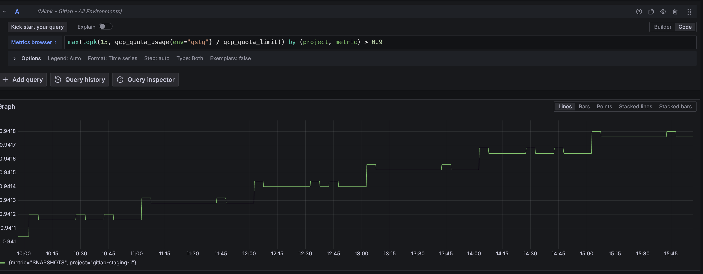

# component_saturation_slo_out_of_bounds:gcp_quota_limit

## Overview

This alert fires when a resource is nearing it's allocated quota in GCP for a given project. When a given quota is reached, we may lose the ability to provision additional resources of that type. In GCP, there are two types of constraints to be aware of that can govern the amount of resources that we are able to provision: [Quotas and system limits](https://cloud.google.com/docs/quotas/overview). Quotas are more flexible, and adjustments can be requested through GCP support, limits are static and cannot be increased. This alert only covers quotas.

Most commonly, this alert will fire when additional resources are being provisioned that push resource utilization close to the existing quota. Less commonly, a quota adjustment may have been made to reduce the maximum allocatable resources.

Almost every resource we provision will have a quota associated with it, depending on the particular resource in question the impacts of reaching the limit could impact every service we operate.

When this alert fires, we should look at the resource and GCP project in question, and identify if utilization has been increasing steadily, or if there is an anomalous spike. If usage appears normal, we should engage with GCP support and request a quota increase.

## Services

Because quotas are applicable to all resources deployed in a given project, it may be difficult to understand exactly which services are the cause, or are being impacted by a quota being reached. Systems that have a higher rate of resource churn are more likely to be impacted by and contribute to quota exhaustion, some of these may include:

- Kubernetes node pools
- ci-runners

Refer to the [service catalog](https://gitlab.com/gitlab-com/runbooks/-/blob/master/services/service-catalog.yml?ref_type=heads) to identify the team that owns a particular service when it's believed to be relevant to this alert firing.

## Metrics

The metrics used in this alert are exported via the [GCP Quota Exporter](https://gitlab.com/gitlab-com/gl-infra/gcp-quota-exporter). Exporter configuration and deployment information can be found in [ArgoCD](https://gitlab.com/gitlab-com/gl-infra/argocd/apps/-/tree/main/services/gcp-quota-exporter) repository.

- Quota saturation is calculated as quota utilization / quota limit. The SLO for these metrics can be found [here](https://gitlab.com/gitlab-com/runbooks/-/blob/master/libsonnet/saturation-monitoring/gcp_quota_limit.libsonnet?ref_type=heads), we currently alert when saturation crosses the 90% threshold.
- You can view these raw metrics in [Grafana Explore](https://dashboards.gitlab.net/explore?schemaVersion=1&panes=%7B%22o3t%22:%7B%22datasource%22:%22e58c2f51-20f8-4f4b-ad48-2968782ca7d6%22,%22queries%22:%5B%7B%22refId%22:%22A%22,%22expr%22:%22topk%2815,%20gcp_quota_usage%20%2F%20gcp_quota_limit%29%22,%22range%22:true,%22instant%22:true,%22datasource%22:%7B%22type%22:%22prometheus%22,%22uid%22:%22e58c2f51-20f8-4f4b-ad48-2968782ca7d6%22%7D,%22editorMode%22:%22code%22,%22legendFormat%22:%22__auto%22%7D%5D,%22range%22:%7B%22from%22:%22now-1h%22,%22to%22:%22now%22%7D%7D%7D&orgId=1)
- Under normal circumstances we do not expect utilization to go above 90%, if we are crossing this threshold on a regular basis, it is advisable to request a quota increase, or determine where the resources are being used, and reduce utilization.
- This is an example of an alert condition (in GSTG) that likely warrants investigation.

## Alert Behavior

- When this alert fires, it may be necessary to create a silence while engaging with GCP support. Most quota increase requests are handled in ~24 hours, so creating a silence for that amount of time is reasonable after opening a support case.

## Severities

Depending on how close to the quota limit we are, and the specific quota in question, the severity may differ significantly. An example of an alert condition that could have customer facing impacts, and thus could be considered S2 severity:

- Quota N2D_CPUS hitting 100% in a GPRD project, which would prevent creation of runner instances or additional capacity to handle customer requests.

And an example condition that is less likely to directly impact customers, and may be considered S3 severity:

- Quota SNAPSHOTS being reached may prevent timely backups from being taken of instances.

## Verification

- View the Quota in the [GCP console](https://console.cloud.google.com/iam-admin/quotas?referrer=search&project=gitlab-production) to confirm accuracy of the Prometheus alert.
- [Grafana Dashboard](https://dashboards.gitlab.net/d/alerts-gcp_quota_limit/alerts3a-gcp-quota-limit3a-saturation-detail?orgId=1)

## Recent changes

- You can view Quota increase requests for a given project in the [GCP console](https://console.cloud.google.com/iam-admin/quotas/qirs?referrer=search&project=gitlab-production)
- Check for recent changes in the [config-mgmt repository](https://ops.gitlab.net/gitlab-com/gl-infra/config-mgmt/-/commits/main?ref_type=heads) to see if additional resources have been recently provisioned in the project.

## Troubleshooting

- Basic troubleshooting steps:
  - Validate that the alert condition is accurate for the resource using the GCP console.
  - Determine whether utilization has been steadily increasing, or if the alert is the result of a spike.
    - The mechanism to do this will vary  depending on the resource type, but a few things to check might be:
      - [Traffic throughput](https://dashboards.gitlab.net/d/frontend-main/frontend3a-overview?orgId=1). Unusually high traffic (perhaps from a DDoS attack) can cause instance groups and node pools to scale up and saturate quota limits.
      - [ci-runner saturation](https://dashboards.gitlab.net/d/ci-runners-main/ci-runners3a-overview?orgId=1&viewPanel=1217942947)
  - If utilization has been climbing gradually, submit a [quota increase request](https://cloud.google.com/docs/quotas/view-manage#requesting_higher_quota), and consider creating a silence for the alert while the request is being processed if it is not approved immediately.

## Possible Resolutions

- Previous occurrences of this alert that have been resolved:
  - [Reverting a CI runner machine type change](https://gitlab.com/gitlab-com/gl-infra/production/-/issues/18160)
  - [Requesting a CPU quota increase](https://gitlab.com/gitlab-com/gl-infra/production/-/issues/17663)
  - [Requesting a snapshot quota increase](https://gitlab.com/gitlab-com/gl-infra/production/-/issues/16027)

## Dependencies

- The only dependencies for this alert are on the GCP Quota Exporter that is deployed in Kubernetes.

## Escalation

- Escalation to Google support is likely to be needed if resource usage growth is organic.
- You can reach out in `#production_engineering` in Slack if it is unclear where the resource utilization increase is coming from.

## Definitions

- [Libsonnet alert definition](https://gitlab.com/gitlab-com/runbooks/-/blob/master/libsonnet/saturation-monitoring/gcp_quota_limit.libsonnet?ref_type=heads)
- [Link to edit this playbook](https://gitlab.com/gitlab-com/runbooks/-/tree/master/docs/uncategorized/alerts/gcp_quota_limit.md)
- [Update the template used to format this playbook](https://gitlab.com/gitlab-com/runbooks/-/edit/master/docs/template-alert-playbook.md?ref_type=heads)

## Related Links

- [Quotas Overview](https://cloud.google.com/docs/quotas/overview)
