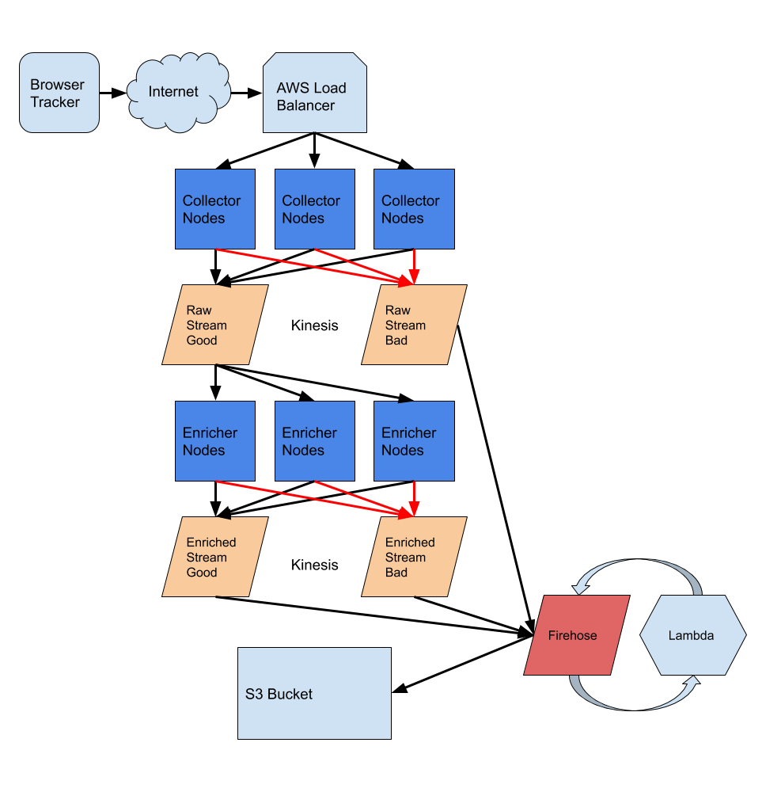

## Overview

SnowPlow is a pipeline of nodes and streams used to accept events from GitLab.com and other applications. This runbook provides guidance for responding to CloudWatch alarms and troubleshooting issues with the Snowplow infrastructure.

## Important Resources

- [Design Document](https://about.gitlab.com/handbook/engineering/infrastructure/design/snowplow/)
- [Terraform Configuration](https://ops.gitlab.net/gitlab-com/gitlab-com-infrastructure/tree/master/environments/aws-snowplow-prd)
- [Cloudwatch Dashboard](https://us-east-2.console.aws.amazon.com/cloudwatch/home?region=us-east-2#dashboards/dashboard/aws-snowplow-prd-tf)
- AWS GPRD account: `855262394183`

## The Pipeline Diagram



## Response Procedures

### Alarm Classification

All alarms include P0/P1/P2 in the name, this is what they represent:

| Priority | Description | Response Time | Impact |
| --- | --- | --- | --- |
| P0 | Critical issues requiring immediate attention | Immediate | Immediate Data loss or service outage |
| P1 | Significant issues requiring prompt action | Within 24 hours | Potential Data Loss in 24-48 hours |
| P2 | Non-urgent issues requiring investigation | Within 1 week | Minimal immediate impact |

### P0 Alarms

P0 alarms indicate critical incidents requiring immediate attention. In the Snowplow infrastructure, this occurs when the Application Load Balancer cannot receive or route events properly, resulting in irrecoverable event loss.

#### Action Steps

1. Create an incident in Slack
   - Follow the [handbook instructions](https://handbook.gitlab.com/handbook/engineering/infrastructure-platforms/incident-management/#report-an-incident-via-slack)
   - Label the incident as **P3** (internal-only classification)
   - In the incident.io Slack channel, tag `@data-engineers @Ankit Panchal @Niko Belokolodov @Jonas Larsen @Ashwin`
   - This tagging prevents duplicate incidents from being created
2. Troubleshoot the issue yourself
   - Review the "What is Important" section below
   - Review logs and metrics in CloudWatch

### P1 Alarms

P1 alarms indicate significant issues requiring action within 24 hours.

#### Action Steps

1. Begin troubleshooting
   - Review the "What is Important" section below
   - Review logs and metrics in CloudWatch
2. If uncertain how to resolve
   - Tag `@vedprakash @Justin Wong` in Slack

### P2 Alarms

P2 alarms indicate potential issues that don't require immediate action but should be addressed.

#### Action Steps

1. Create an issue
   - Log the issue in the [analytics project](https://gitlab.com/gitlab-data/analytics)
   - Include alarm details, timestamps, and any patterns observed
2. Investigate when convenient
3. If blocked on resolution
   - Tag `@juwong` in the issue

## What is Important?

If you are reading this, most likely one of two things has gone wrong. Either the SnowPlow pipeline has stopped accepting events or it has stopped writing events to the S3 bucket.

- **Not accepting requests** is a big problem and should be fixed as soon as possible. Collecting events is important and a synchronous process.
- **Processing events and writing them out** is important, but not as time-sensitive. There is some slack in the queue to allow events to stack up before being written.
  - The raw events Kinesis stream has a data retention period of 48 hours. This can be altered if needed in a dire situation by modifying the `retention_period` argument in [aws-snowplow-prd/main.tf](https://ops.gitlab.net/gitlab-com/gl-infra/config-mgmt/-/blob/main/environments/aws-snowplow-prd/main.tf?ref_type=heads).

## Troubleshooting Guide

### Problem 1: Not accepting requests

1. A quick curl check should give you a good response of **OK**. This same URL is used for individual collector nodes to check health against port 8000:

   ```sh
   curl https://snowplowprd.trx.gitlab.net/health
   ```

2. Log into GPRD AWS and verify that there are collector nodes in the [`SnowPlowNLBTargetGroup`](https://us-east-2.console.aws.amazon.com/ec2/home?region=us-east-2#TargetGroup:targetGroupArn=arn:aws:elasticloadbalancing:us-east-2:855262394183:targetgroup/SnowPlowPRDNLBTargetGroup/643ac960b36da760) EC2 auto-scaling target group. If not, something has gone wrong with the snowplow PRD collector Auto Scaling group.

3. Check `Cloudflare` and verify that the DNS name is still pointing to the EC2 SnowPlow load balancer DNS name. The record in Cloudflare should be a `CNAME`.
   - aws-snowplow-prd env, DNS name: `snowplowprd.trx.gitlab.net`

4. If there are EC2 `collectors` running, you can SSH (see 'How to SSH into EC2 instances' section) into the instance and then check the logs by running:

   ```sh
   docker logs --tail 15 stream-collector
   ```

5. Are the collectors writing events to the raw (good or bad) Kinesis streams?
   - Look at the [Cloudwatch dashboard](https://us-east-2.console.aws.amazon.com/cloudwatch/home?region=us-east-2#dashboards/dashboard/aws_snowplow_prd), or go to the `Kinesis Data streams` service in AWS and look at the stream monitoring tabs.

### Problem 2: Not writing events out

1. First, make sure the collectors are working ok by looking over the steps above. It's possible that if nothing is getting collected, nothing is being written out.

2. In the [aws-snowplow-prd](https://us-east-2.console.aws.amazon.com/cloudwatch/home?region=us-east-2#dashboards/dashboard/aws-snowplow-prd-tf) Cloudwatch dashboard, look at the **Stream Records Age** graph to see if a Kinesis stream is backing up. This graph shows the milliseconds that records are left in the streams and it should be zero most of the time. If there are lots of records backing up, the enrichers may not be picking up work, or Firehose is not writing records to S3.

3. Verify there are running enricher instances by checking the `SnowPlowEnricher` auto scaling group.

4. There is no current automated method to see if the enricher processes are running on the nodes. To check the logs, SSH (see 'How to SSH into EC2 instances' section) into one of the enricher instances and then run:

   ```sh
   docker logs --tail 15 stream-enrich
   ```

5. Are the enricher nodes picking up events and writing them into the enriched Kinesis streams? Look for the `Kinesis stream monitoring` tabs.

6. Check that the `Kinesis Firehose` monitoring for the enriched (good and bad) streams are processing events. You may want to turn on CloudWatch logging if you are stuck and can't seem to figure out what's wrong.

7. Check the `Lambda` function that is used to process events in Firehose. There should be plenty of invocations at any time of day. A graph of invocations is also in Cloudwatch.

### Problem 3: enriched_bad_records_high_P2

Investigation is needed if you see a AWS alert in slack for `enriched_bad_records_high_P2`.

**Priority:** P2 - Try to investigate by today or tomorrow

**Investigation Options**:

**Option 1: Snowflake (Recommended)**

<details><summary>Investigative queries</summary>

```sql
SELECT *
FROM raw.snowplow.gitlab_bad_events
WHERE uploaded_at BETWEEN '' and '';

-- get count in 10 minute incrementals
SELECT
TIME_SLICE(uploaded_at, 10, 'MINUTE') AS uploaded_at_10min,
COUNT(*)
FROM raw.snowplow.gitlab_bad_events
WHERE uploaded_at BETWEEN '' AND ''
GROUP BY uploaded_at_10min
ORDER BY uploaded_at_10min
LIMIT 100;
```

</details>

**Option 2: S3 Bucket**

[Bad event S3 bucket](https://us-east-2.console.aws.amazon.com/s3/buckets/gitlab-com-snowplow-prd-events?region=us-east-2&bucketType=general&prefix=enriched-bad/&showversions=false) (less convenient for analysis)

#### Look for Patterns

Analyze these key fields for commonalities:

- `failures.message` - Same error repeated?
- `se_action` / `se_category` - Specific event type failing?

#### Action Required

- **Diverse errors from various sources:** Can be ignored (normal noise)
- **Clear pattern identified:** Open an issue and investigate. Ask `##g_analytics_analytics_instrumentation` for help if you suspect upstream issue.

## Lambda Troubleshooting

**Key Clarification**: when a lambda fails, the events aren't always necessarily written to `bad_events` table. To better understand the flow, please refer to `Processing Flow Reference` section.

### Notification

You will find out there's an issue by the following alerts/clues:

1. Cloudwatch alarms are firing to `#data-prom-alerts`
2. Snowpipe failures in `#data-pipelines`
3. Cloudwatch dashboard showing low lambda success
4. `raw.snowplow.bad_gitlab_events` showing many records with failing lambda function.

### High-level Troubleshooting Steps

The main focus when troubleshooting Lambda failures is identifying which data stream failed and taking appropriate action. Follow these steps:

#### 1. Identify the Failed Data Stream

Lambda failures typically occur on either `enriched_good` or `enriched_bad` streams, if you're not sure which stream had the failure, please see the `Processing Flow Reference`.

#### 2. Handle enriched_bad Lambda Failures

If the `enriched_bad` lambda is failing:

- **Priority**: Lower impact - bad events aren't typically used in production
- **Action Required**: Fix the lambda when possible, but not urgent

#### 3. Handle enriched_good Lambda Failures

If the `enriched_good` lambda is failing:

- **Priority**: HIGH - These are production events
- **Actions Required**:
  1. Fix the lambda immediately
  2. Restore/repair affected production data

### Processing Flow Reference

This flow reference is useful to understand how to identify which lambda is failing.

<details><summary>report - click this</summary>

#### S3 Failure Locations

When Lambda fails, Firehose writes to these S3 `processing-failed` prefixes, depending on which Kinesis stream the event originated from:

1. **raw_bad** Kinesis stream: [s3://gitlab-com-snowplow-prd-events/raw-bad/processing-failed/](https://us-east-2.console.aws.amazon.com/s3/buckets/gitlab-com-snowplow-prd-events?region=us-east-2&bucketType=general&prefix=raw-bad%2F&showversions=false&tab=objects)
2. **enriched_bad**: [s3://gitlab-com-snowplow-prd-events/enriched-bad/processing-failed/](https://us-east-2.console.aws.amazon.com/s3/buckets/gitlab-com-snowplow-prd-events?region=us-east-2&bucketType=general&prefix=enriched-bad%2F&showversions=false&tab=objects)
3. **enriched_good**: [s3://gitlab-com-snowplow-prd-events/output/processing-failed/](https://us-east-2.console.aws.amazon.com/s3/buckets/gitlab-com-snowplow-prd-events?region=us-east-2&bucketType=general&prefix=output%2F&showversions=false&tab=objects)

#### Snowpipe Destinations

- **raw_bad**: No Snowpipe → No destination table
- **enriched_bad**: Snowpipe → `raw.snowplow.bad_gitlab_events`
- **enriched_good**: Snowpipe → `raw.snowplow.gitlab_events` (PRODUCTION)

</details>

### Debugging Lambda

<details><summary>report - click this</summary>

#### Option 1: Check Snowflake Error Logs

For `enriched_bad` lambda failures:

- Query `raw.snowplow.gitlab_bad_events` table
- Check the `jsontext` column for lambda error messages

#### Option 2: Check AWS CloudWatch Logs

1. Go to [AWS Lambda Console](https://us-east-2.console.aws.amazon.com/lambda/home?region=us-east-2#/functions)
2. Select the failing lambda function
3. Click "View CloudWatch logs"
4. Review error messages and stack traces

</details>

### Production Data Recovery Process

<details><summary>report - click this</summary>

#### When Data Recovery is Required

Data recovery is necessary when `enriched_good` lambda failures result in malformed production events in `raw.snowplow.gitlab_events`.

#### Recovery Method: In-Place Data Repair

If events exist in production but are malformed with embedded `rawData`:

1. **Identify affected events** using the query pattern below
2. **Decode and parse** the base64 `rawData` string
3. **Update the table in-place** to restore proper column structure
**Example recovery script**: [GitLab Analytics Issue #25169](https://gitlab.com/gitlab-data/analytics/-/issues/25169#note_2789234724)

#### Identifying Malformed Records in prod gitlab_events table

##### Current Lambda Failure Pattern

Failed records have the entire payload in `app_id` column:

```json
{"rawData":"Z2l0bGFiCXNydgkyMDI1LTA5LTI5IDE0O....."}
```

##### Detection Query

```sql
SELECT *
FROM raw.snowplow.gitlab_events
WHERE collector_tstamp IS NULL
  AND uploaded_at BETWEEN '[START_TIME]' AND '[END_TIME]'  -- Use S3 processing-failed/ timestamps
LIMIT 100;
```

</details>

## Cloudwatch Dashboard

The [Cloudwatch dashboard](https://us-east-2.console.aws.amazon.com/cloudwatch/home?region=us-east-2#dashboards/dashboard/aws_snowplow_prd) is useful to quickly understand the state of the infrastructure when you're debugging a problem. It's organized by service, in chronological order of how an event passes through (LB -> EC2 -> Kinesis, etc)

In the past, some important widgets in the dashboard have been:

1. `Kinesis stream records age`: the most important because it measures how long events are sitting in Kinesis (which means they're not getting enriched, in the past we have had problem with it backing up)
2. `Auto-scaling group size`: if we see collectors scaling up, but not scaling back down, we may need to increase the number of collectors to make sure we're always ready to ingest bigger event traffic

## Maintenance Procedures

### Updating enricher config

The Snowplow collector and enricher instances are started with launch configuration templates.
These launch configuration templates include the Snowplow configs- `collector-user-data.sh` and `enricher-user-data.sh`.

The Snowplow configs are used to configure how the Snowplow collector/enricher and the Kinesis stream interact, and may occasionally need to be updated, here are the steps:

1. Within the .sh file(s), update the Snowplow config values
2. Create an MR to apply the changes, which should update the aws_launch_configuration resource, [example MR](https://ops.gitlab.net/gitlab-com/gl-infra/config-mgmt/-/merge_requests/9788)

Lastly, to check that your config has been updated, ssh into one of the instances (see 'How to SSH into EC2 instances' section) and run:

```sh
cat /snowplow/config/config.hocon
```

### EC2 instance refresh

You may need to do a instance refresh manually, for example because:

- instances have become unresponsive

Here are the instructions:

1. The instances need to be terminated/recreated for them to use the updated config. To access the `instance_refresh` tab in the UI:
   - go to EC2 -> Auto Scaling groups -> click 'snowplow PRD enricher' or 'snowplow PRD collector' -> Instance refresh
2. Once in the 'Instance refresh' tab, click 'Start instance refresh'
3. For settings, use:
   - Terminate and launch (default already)
   - Set healthy percentage, Min=`95%`
   - the rest of the settings, you can leave as is
4. Click 'Start instance refresh', and track its progress

## Important Notes

### A note on burstable machines

Currently, the EC2 collector/enricher instances both use the `t` [machine types](https://aws.amazon.com/ec2/instance-types/).

These machine types are [burstable](https://docs.aws.amazon.com/AWSEC2/latest/UserGuide/burstable-performance-instances.html):

> The T instance family provides a baseline CPU performance with the ability to burst above the baseline at any time for as long as required

When the instances are bursting, they consume CPU credits.

If the CPU usage is especially high, it may not be apparent at first, because the machines are bursting.
But once all CPU credits have been consumed the machines can no longer burst, and this could lead to degradation of the system, as seen in the `2024-12-10` incident.

As such, it's important to do the following:

- be aware that we are using burstable instances
- keep an eye on the CPU credits, which can be found in the aforementioned Cloudwatch dashboard

### How to SSH into EC2 instances

There are 2 ways to SSH into EC2 instance:

1. Using `EC2 Instance Connect` (AWS UI):
   - Login to AWS and go to [EC2 Instances](https://us-east-2.console.aws.amazon.com/ec2/home?region=us-east-2#Instances:)
   - click the `instance_id` that you want to enter, then click the 'Connect' tab
   - Select `Connect using EC2 Instance Connect` (it should be selected by default), and then click 'Connect'
2. From bastion host:
   - you will need the `snowplow.pem` file from 1Password Production Vault and you will connect to the nodes as the `ec2-user`. Your command should look something like this:

     ```sh
     ssh -i "snowplow.pem"  ec2-user@<ec2-ip-address>
     ```

## Past Incidents

Incident list starting in December, 2024. This list is not guaranteed to be complete, but could be useful to reference for future incidents:

1. [2024-12-01: Investigate why snowplow good events backing up takes time](https://gitlab.com/gitlab-org/gitlab/-/issues/507248#note_2241426826)
2. [2024-12-10: Snowplow enriched events are not getting processed](https://gitlab.com/gitlab-com/gl-infra/production/-/issues/18975#note_2251924192)

## Prioritizing gitlab.com traffic

In this [issue discussion](https://gitlab.com/gitlab-org/architecture/gitlab-data-analytics/design-doc/-/issues/133#note_2421345856), it was requested that we have some mechanism to prioritize gitlab.com traffic over Self-Managed (SM) traffic, in an emergency situation.

If this scenario arises, here is the plan:

1. **Drop** SM requests using ALB [fixed-response actions](https://docs.aws.amazon.com/elasticloadbalancing/latest/application/load-balancer-listeners.html#fixed-response-actions)
   - Prepared MR: [ops.gitlab.net/10898](https://ops.gitlab.net/gitlab-com/gl-infra/config-mgmt/-/merge_requests/10898)
   - Additional context if needed: [Issue #148](https://gitlab.com/gitlab-org/architecture/gitlab-data-analytics/design-doc/-/issues/148)
1. Prepare a new environment in config-mgmt specifically for Self-Managed instance traffic, see [HOWTO.md](https://ops.gitlab.net/gitlab-com/gl-infra/config-mgmt/-/blob/main/HOWTO.md?ref_type=heads#create-an-environment)
