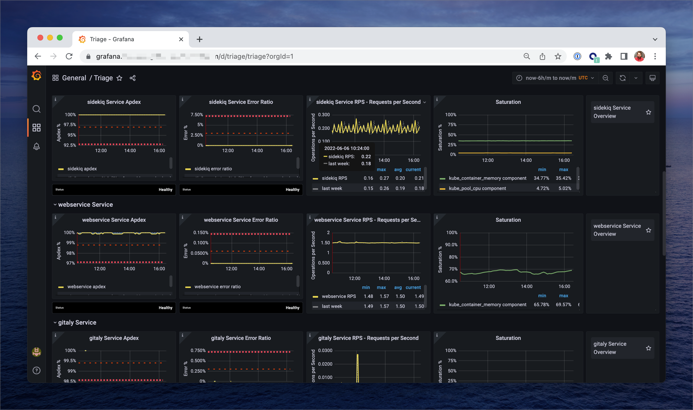
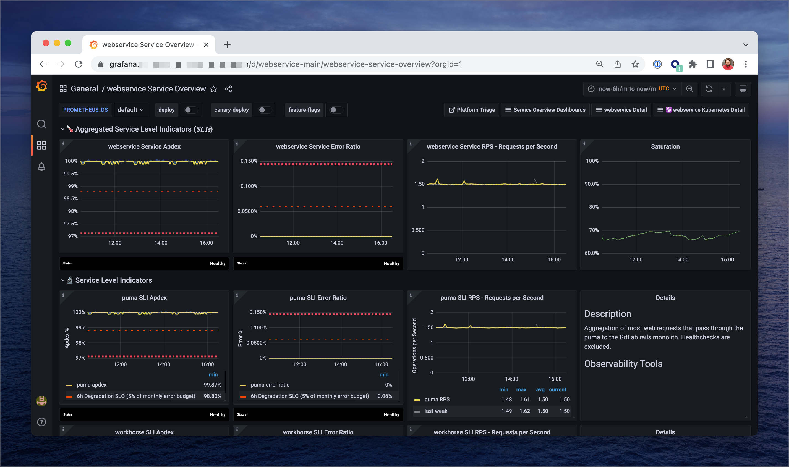
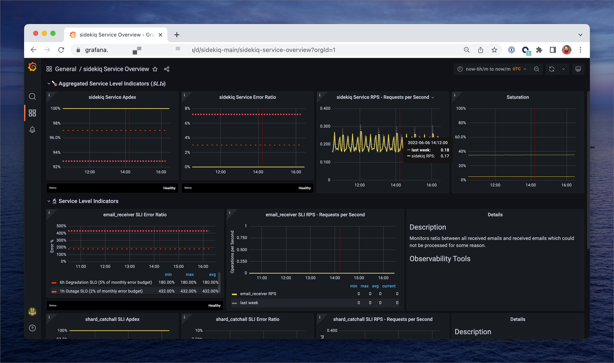
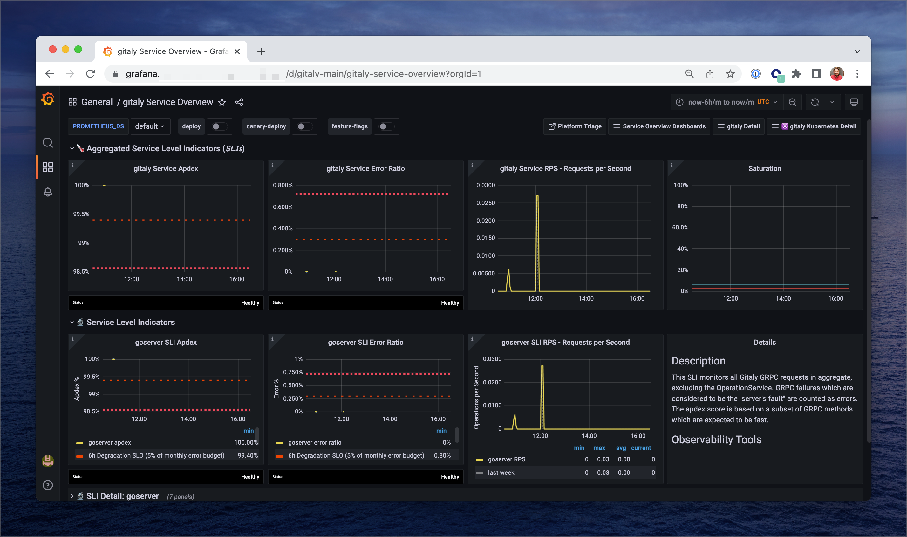

# GitLab GET Hybrid Environment SLO Monitoring

This reference architecture is designed for use within a [GET](https://gitlab.com/gitlab-org/quality/gitlab-environment-toolkit)
Hybrid environment, with Rails and Sidekiq services running inside Kubernetes, and Gitaly running on VMs.

## Screenshots

Here are some examples of the dashboards generated for this reference architecture.

|                                                         |                                                                |
| ------------------------------------------------------- | -------------------------------------------------------------- |
| **Triage Grafana Dashboard**                            | **Web Service Grafana Dashboard**                              |
|    |  |
| **Sidekiq Grafana Dashboard**                           | **Gitaly Grafana Dashboard**                                   |
|  |           |

## Diving Deeper

1. [GET Hybrid Environment](https://gitlab.com/gitlab-org/quality/gitlab-environment-toolkit/-/blob/main/docs/environment_advanced_hybrid.md) documentation.
1. [ScaleConf talk describing how these dashboards are generated](https://www.youtube.com/watch?v=2zL9DymXi1E)
1. [Apdex alerts troubleshooting runbook](../../docs/monitoring/apdex-alerts-guide.md)
1. [Incident Diagnosis in a Symptom-based World](../tutorials/diagnosis.md)

## Monitored Components

<!-- markdownlint-disable MD060 -->
<!-- MARKER:slis: do not edit this section directly. -->
## Service Level Indicators

| **Service** | **Component** | **Description** | **Apdex** | **Error Ratio** | **Operation Rate** |
| ----------- | ------------- | --------------- | --------- | --------------- | ------------------ |
| `gitaly` | `goserver` | This SLI monitors all Gitaly GRPC requests in aggregate, excluding the OperationService. GRPC failures which are considered to be the "server's fault" are counted as errors. The apdex score is based on a subset of GRPC methods which are expected to be fast.  | ✅ SLO: 99.9% | ✅ SLO: 99.95% | ✅ |
| `gitlab-shell` | `grpc_requests` | A proxy measurement of the number of GRPC SSH service requests made to Gitaly and Praefect.  Since we are unable to measure gitlab-shell directly at present, this is the best substitute we can provide.  | ✅ SLO: 99.9% | ✅ SLO: 99.9% | ✅ |
| `kube` | `apiserver` | The Kubernetes API server validates and configures data for the api objects which include pods, services, and others. The API Server services REST operations and provides the frontend to the cluster's shared state through which all other components interact.  This SLI measures all non-health-check endpoints. Long-polling endpoints are excluded from apdex scores.  | ✅ SLO: 99.9% | ✅ SLO: 99.95% | ✅ |
| `nginx` | `nginx_ingress` | All requests passing through the Nginx ingress controller. Errors are 5xx status codes.  | - | ✅ SLO: 99.9% | ✅ |
| `praefect` | `proxy` | All Gitaly operations pass through the Praefect proxy on the way to a Gitaly instance. This SLI monitors those operations in aggregate.  | ✅ SLO: 99.5% | ✅ SLO: 99.95% | ✅ |
| `praefect` | `replicator_queue` | Praefect replication operations. Latency represents the queuing delay before replication is carried out.  | ✅ SLO: 99.5% | - | ✅ |
| `redis` | `primary_server` | Operations on the Redis primary for Redis instance.  | - | - | ✅ |
| `redis` | `rails_redis_client` | Aggregation of all Redis operations issued from the Rails codebase through `Gitlab::Redis::Wrapper` subclasses.  | ✅ SLO: 99.95% | ✅ SLO: 99.9% | ✅ |
| `redis` | `redis` |  | ✅ SLO: 99.95% | - | ✅ |
| `registry` | `server` | Aggregation of all registry HTTP requests.  | ✅ SLO: 99.7% | ✅ SLO: 99.99% | ✅ |
| `registry` | `server_route_blob_digest_deletes` | Delete requests for the blob digest endpoints on the registry.  Used to delete blobs identified by name and digest.  | ✅ SLO: 99.9% | - | ✅ |
| `registry` | `server_route_blob_digest_reads` | All read-requests (GET or HEAD) for the blob endpoints on the registry.  GET is used to pull a layer gated by the name of repository and uniquely identified by the digest in the registry.  HEAD is used to check the existence of a layer.  | ✅ SLO: 98% | - | ✅ |
| `registry` | `server_route_blob_digest_writes` | Write requests (PUT or PATCH or POST) for the registry blob digest endpoints.  Currently not part of the spec.  | ✅ SLO: 99.7% | - | ✅ |
| `registry` | `server_route_blob_upload_uuid_deletes` | Delete requests for the registry blob upload endpoints.  Used to cancel outstanding upload processes, releasing associated resources.  | ✅ SLO: 99.7% | - | ✅ |
| `registry` | `server_route_blob_upload_uuid_reads` | Read requests (GET) for the registry blob upload endpoints.  GET is used to retrieve the current status of a resumable upload.  | ✅ SLO: 99.7% | - | ✅ |
| `registry` | `server_route_blob_upload_uuid_writes` | Write requests (PUT or PATCH) for the registry blob upload endpoints.  PUT is used to complete the upload specified by uuid, optionally appending the body as the final chunk.  PATCH is used to upload a chunk of data for the specified upload.  | ✅ SLO: 97% | - | ✅ |
| `secrets-manager` | `openbao_requests` | Non-login requests to OpenBao API for secrets manager operations. | - | - | ✅ |
| `sidekiq` | `sidekiq_execution` | Sidekiq job completion timings.   This is the time it takes for jobs to execute once they've been picked up by a worker.  A dip in this apdex indicates that jobs are not completing within the expected time frame.  This can be caused by many possibilities, including:  1. Resource contention in the workers (e.g. thread contention for CPU time, due to high concurrency),  2. Resource contention in other resources (e.g. database CPU saturation),  3. Poorly performing worker code or queries   Satisfied queue latency thresholds are defined in the application by urgency.  See <https://docs.gitlab.com/development/sidekiq/worker_attributes/#job-urgency>   1. 10s for high urgency jobs.  2. 5m for low urgency jobs.  3. 5m for throttled jobs.  | ✅ SLO: 99.5% | ✅ SLO: 99.5% | ✅ |
| `sidekiq` | `sidekiq_queueing` | Sidekiq queue latency per shard.  This is the time it takes for jobs to be picked up in the queue. A dip in this Apdex indicates that the queues are saturated and cannot process the backlog of jobs fast enough.  Satisfied queue latency thresholds are defined in the application by urgency. See <https://docs.gitlab.com/development/sidekiq/worker_attributes/#job-urgency>  1. 10s for high urgency jobs. 2. 1m for low urgency jobs. 3. throttled jobs do not have an expected duration.  | ✅ SLO: 99.5% | - | ✅ |
| `webservice` | `graphql_query` | A GraphQL query is executed in the context of a request. An error does not always result in a 5xx error. But could contain errors in the response. Mutliple queries could be batched inside a single request.  This SLI counts all operations, a succeeded operation does not contain errors in it's response or return a 500 error.  The number of GraphQL queries meeting their duration target based on the urgency of the endpoint. By default, a query should take no more than 1s. We're working on making the urgency customizable in [this epic](https://gitlab.com/groups/gitlab-org/-/epics/5841).  We're only taking known operations into account. Known operations are queries defined in our codebase and originating from our frontend.  | ✅ SLO: 99.8% | ✅ SLO: 99.9% | ✅ |
| `webservice` | `puma` | Aggregation of most web requests that pass through the puma to the GitLab rails monolith. Healthchecks are excluded.  | ✅ SLO: 99.8% | ✅ SLO: 99.9% | ✅ |
| `webservice` | `rails_queueing` | Apdex for time workhorse spends waiting for a free Puma worker.  When this alerts, a noticeable proportion of requests are arriving a Puma when there are no free workers, and thus queue for processing until a worker is free.  Such queuing adds latency to the request which will often be user visible.  Typically other apdex alerts will also be out of spec at the same time; this SLI adds signal that queuing is part of the problem, rather than only being slow processing requests with spare capacity in Puma for other requests.  It typically indicates higher use of the system than it has been provisioned to handle; it can be resolved by either adding Puma workers (pods and nodes) or by finding high RPS traffic that can be eliminated.  | ✅ SLO: 99.8% | - | ✅ |
| `webservice` | `workhorse` | Aggregation of most rails requests that pass through workhorse, monitored via the HTTP interface. Excludes API requests, git requests, health, readiness and liveness requests. Some known slow requests, such as HTTP uploads, are excluded from the apdex score.  | ✅ SLO: 99.8% | ✅ SLO: 99.9% | ✅ |
| `webservice` | `workhorse_api` | Aggregation of most API requests that pass through workhorse, monitored via the HTTP interface.  The workhorse API apdex has a longer apdex latency than the web to allow for slow API requests.  | ✅ SLO: 99.8% | ✅ SLO: 99.9% | ✅ |
| `webservice` | `workhorse_cached` | Aggregation of default-route web requests that rely on etag caching, but have known issues and are slow in the application. This is not expected, but it is a known temporary problem that we should work to fix in the application.  This workhorse cached apdex has a longer apdex latency than the web to allow for slow API requests.  | ✅ SLO: 99.8% | - | ✅ |
| `webservice` | `workhorse_git` | Aggregation of git+https requests that pass through workhorse, monitored via the HTTP interface.  For apdex score, we avoid potentially long running requests, so only use the info-refs endpoint for monitoring git+https performance.  | ✅ SLO: 99.8% | ✅ SLO: 99.9% | ✅ |
<!-- END_MARKER:slis -->
<!-- markdownlint-restore -->

## Saturation Monitoring

Saturation monitoring is handled differently to the service-level monitoring described above. Each monitored resource is represented as a finite resource with a current value between 0% (unutilized) and 100% (completely saturated). Each saturation resource has a threshold SLO over which it will alert.

:warning: Some metrics below require user-supplied recording rules for full functionality.

- `aws_rds_memory_saturation` - requires metric `rdsInstanceRAMBytes`
- `aws_rds_used_connections` - requires metric `rdsInstanceRAMBytes`

Note that these metrics may have other requirements, please see the metric definitions for further details.

<!-- markdownlint-disable MD060 -->
<!-- MARKER:saturation: do not edit this section directly. -->
### Monitored Saturation Resources

| **Resource** | **Applicable Services** | **Description** | **Horizontally Scalable?** | **Alerting Threshold** |
| ------------ | ----------------------- | --------------- | -------------------------- | -----------------------|
| `cpu` | `consul`, `gitaly`, `praefect`, `secrets-manager` | This resource measures average CPU utilization across an all cores in a service fleet. If it is becoming saturated, it may indicate that the fleet needs horizontal or vertical scaling.  | ✅ | 90% |
| `disk_inodes` | `consul`, `gitaly`, `praefect`, `secrets-manager` | Disk inode utilization per device per node.  If this is too high, its possible that a directory is filling up with files. Consider logging in an checking temp directories for large numbers of files  | ✅ | 80% |
| `disk_space` | `consul`, `gitaly`, `praefect`, `secrets-manager` | Disk space utilization per device per node.  | ✅ | 90% |
| `excluded_sidekiq_kube_container_rss_request` | `sidekiq` | Records the total anonymous (unevictable) memory utilization for containers for this service, as a percentage of the memory request as configured through Kubernetes.  This is computed using the container's resident set size (RSS), as opposed to kube_container_memory which uses the working set size. For our purposes, RSS is the better metric as cAdvisor's working set calculation includes pages from the filesystem cache that can (and will) be evicted before the OOM killer kills the cgroup.  A container's RSS (anonymous memory usage) is still not precisely what the OOM killer will use, but it's a better approximation of what the container's workload is actually using. RSS metrics can, however, be dramatically inflated if a process in the container uses MADV_FREE (lazy-free) memory. RSS will include the memory that is available to be reclaimed without a page fault, but not currently in use.  The most common case of OOM kills is for anonymous memory demand to overwhelm the container's memory request. On swapless hosts, anonymous memory cannot be evicted from the page cache, so when a container's memory usage is mostly anonymous pages, the only remaining option to relieve memory pressure may be the OOM killer.  As container RSS approaches container memory request, OOM kills become much more likely. Consequently, this ratio is a good leading indicator of memory saturation and OOM risk.  | - | 90% |
| `go_goroutines` | `gitaly`, `praefect`, `secrets-manager` | Go goroutines utilization per node.  Goroutines leaks can cause memory saturation which can cause service degradation.  A limit of 250k goroutines is very generous, so if a service exceeds this limit, it's a sign of a leak and it should be dealt with.  | ✅ | 98% |
| `go_memory` | `gitaly`, `praefect`, `secrets-manager` | Go's memory allocation strategy can make it look like a Go process is saturating memory when measured using RSS, when in fact the process is not at risk of memory saturation. For this reason, we measure Go processes using the `go_memstat_alloc_bytes`  | ✅ | 98% |
| `kube_container_cpu_limit` | `consul`, `gitlab-shell`, `nginx`, `registry`, `sidekiq`, `webservice` | Kubernetes containers can have a limit configured on how much CPU they can consume in a burst. If we are at this limit, exceeding the allocated requested resources, we should consider revisting the container's HPA configuration.  When a container is utilizing CPU resources up-to it's configured limit for extended periods of time, this could cause it and other running containers to be throttled.  | ✅ | 99% |
| `kube_container_memory_limit` | `consul`, `gitlab-shell`, `registry` | This uses the working set size from cAdvisor for the cgroup's memory usage. That may not be a good measure as it includes filesystem cache pages that are not necessarily attributable to the application inside the cgroup, and are permitted to be evicted instead of being OOM killed.  | - | 90% |
| `kube_container_memory_request` | `consul`, `gitlab-shell`, `registry`, `sidekiq` | This uses the working set size from cAdvisor for the cgroup's memory usage. That may not be a good measure as it includes filesystem cache pages that are not necessarily attributable to the application inside the cgroup, and are permitted to be evicted instead of being OOM killed.  | - | 90% |
| `kube_container_rss_limit` | `nginx`, `sidekiq`, `webservice` | Records the total anonymous (unevictable) memory utilization for containers for this service, as a percentage of the memory limit as configured through Kubernetes.  This is computed using the container's resident set size (RSS), as opposed to kube_container_memory which uses the working set size. For our purposes, RSS is the better metric as cAdvisor's working set calculation includes pages from the filesystem cache that can (and will) be evicted before the OOM killer kills the cgroup.  A container's RSS (anonymous memory usage) is still not precisely what the OOM killer will use, but it's a better approximation of what the container's workload is actually using. RSS metrics can, however, be dramatically inflated if a process in the container uses MADV_FREE (lazy-free) memory. RSS will include the memory that is available to be reclaimed without a page fault, but not currently in use.  The most common case of OOM kills is for anonymous memory demand to overwhelm the container's memory limit. On swapless hosts, anonymous memory cannot be evicted from the page cache, so when a container's memory usage is mostly anonymous pages, the only remaining option to relieve memory pressure may be the OOM killer.  As container RSS goes over the container memory request and approaches container memory limit, OOM kills become much more likely. Consequently, this ratio is a good leading indicator of memory saturation and OOM risk.  | - | 90% |
| `kube_container_rss_request` | `nginx`, `webservice` | Records the total anonymous (unevictable) memory utilization for containers for this service, as a percentage of the memory request as configured through Kubernetes.  This is computed using the container's resident set size (RSS), as opposed to kube_container_memory which uses the working set size. For our purposes, RSS is the better metric as cAdvisor's working set calculation includes pages from the filesystem cache that can (and will) be evicted before the OOM killer kills the cgroup.  A container's RSS (anonymous memory usage) is still not precisely what the OOM killer will use, but it's a better approximation of what the container's workload is actually using. RSS metrics can, however, be dramatically inflated if a process in the container uses MADV_FREE (lazy-free) memory. RSS will include the memory that is available to be reclaimed without a page fault, but not currently in use.  The most common case of OOM kills is for anonymous memory demand to overwhelm the container's memory request. On swapless hosts, anonymous memory cannot be evicted from the page cache, so when a container's memory usage is mostly anonymous pages, the only remaining option to relieve memory pressure may be the OOM killer.  As container RSS approaches container memory request, OOM kills become much more likely. Consequently, this ratio is a good leading indicator of memory saturation and OOM risk.  | - | 90% |
| `kube_persistent_volume_claim_disk_space` | `kube` | disk space utilization on persistent volume claims.  | ✅ | 90% |
| `kube_persistent_volume_claim_inodes` | `kube` | inode utilization on persistent volume claims.  | ✅ | 90% |
| `memory` | `consul`, `gitaly`, `praefect`, `secrets-manager` | Memory utilization per device per node.  | ✅ | 98% |
| `memory_redis_cache` |  | Memory utilization per device per node.   redis-cluster-cache has a separate saturation point for this to exclude it from capacity planning calculations.  | ✅ | 98% |
| `node_group_cpu` | `kube` | This resource measures average CPU utilization across an all cores in a node group  If it is becoming saturated, it may indicate that the node group needs resizing.  | ✅ | 90% |
| `node_schedstat_waiting` | `consul`, `gitaly`, `praefect`, `secrets-manager` | Measures the amount of scheduler waiting time that processes are waiting to be scheduled, according to [`CPU Scheduling Metrics`](https://www.robustperception.io/cpu-scheduling-metrics-from-the-node-exporter).  A high value indicates that a node has more processes to be run than CPU time available to handle them, and may lead to degraded responsiveness and performance from the application.  Additionally, it may indicate that the fleet is under-provisioned.  | ✅ | 15% |
| `opensearch_cpu` |  | Average CPU utilization.  This resource measures the CPU utilization for the selected cluster or domain. If it is becoming saturated, it may indicate that the fleet needs horizontal or vertical scaling. The metrics are coming from cloudwatch_exporter.  | ✅ | 80% |
| `opensearch_disk_space` |  | Disk utilization for Opensearch  | ✅ | 75% |
| `pg_btree_bloat` |  | This estimates the total bloat in Postgres Btree indexes, as a percentage of total index size.  IMPORTANT: bloat estimates are rough and depending on table/index structure, can be off for individual indexes, in some cases significantly (10-50%).  The larger this measure, the more pages will unnecessarily be retrieved during index scans.  | - | 70% |
| `pg_table_bloat` |  | This measures the total bloat in Postgres Table pages, as a percentage of total size. This includes bloat in TOAST tables, and excludes extra space reserved due to fillfactor.  | - | 40% |
| `pg_vacuum_activity` |  | This measures the total saturation of autovacuum workers, as a percentage of total autovacuum capacity.  | ✅ | 90% |
| `pg_xid_wraparound` |  | Risk of DB shutdown in the near future, approaching transaction ID wraparound.  This is a critical situation.  This saturation metric measures how close the database is to Transaction ID wraparound.  When wraparound occurs, the database will automatically shutdown to prevent data loss, causing a full outage.  Recovery would require entering single-user mode to run vacuum, taking the site down for a potentially multi-hour maintenance session.  To avoid reaching the db shutdown threshold, consider the following short-term actions:  1. Escalate to the SRE Datastores team, and then,  2. Find and terminate any very old transactions. The runbook for this alert has details.  Do this first.  It is the most critical step and may be all that is necessary to let autovacuum do its job.  3. Run a manual vacuum on tables with oldest relfrozenxid.  Manual vacuums run faster than autovacuum.  4. Add autovacuum workers or reduce autovacuum cost delay, if autovacuum is chronically unable to keep up with the transaction rate.  Long running transaction dashboard: <https://dashboards.gitlab.net/d/alerts-long_running_transactions/alerts-long-running-transactions?orgId=1>  | - | 70% |
| `puma_workers` | `webservice` | Puma thread utilization.  Puma uses a fixed size thread pool to handle HTTP requests. This metric shows how many threads are busy handling requests. When this resource is saturated, we will see puma queuing taking place. Leading to slowdowns across the application.  Puma saturation is usually caused by latency problems in downstream services: usually Gitaly or Postgres, but possibly also Redis. Puma saturation can also be caused by traffic spikes.  | ✅ | 90% |
| `sidekiq_kube_container_rss_request` | `sidekiq` | Records the total anonymous (unevictable) memory utilization for containers for this service, as a percentage of the memory request as configured through Kubernetes.  This is computed using the container's resident set size (RSS), as opposed to kube_container_memory which uses the working set size. For our purposes, RSS is the better metric as cAdvisor's working set calculation includes pages from the filesystem cache that can (and will) be evicted before the OOM killer kills the cgroup.  A container's RSS (anonymous memory usage) is still not precisely what the OOM killer will use, but it's a better approximation of what the container's workload is actually using. RSS metrics can, however, be dramatically inflated if a process in the container uses MADV_FREE (lazy-free) memory. RSS will include the memory that is available to be reclaimed without a page fault, but not currently in use.  The most common case of OOM kills is for anonymous memory demand to overwhelm the container's memory request. On swapless hosts, anonymous memory cannot be evicted from the page cache, so when a container's memory usage is mostly anonymous pages, the only remaining option to relieve memory pressure may be the OOM killer.  As container RSS approaches container memory request, OOM kills become much more likely. Consequently, this ratio is a good leading indicator of memory saturation and OOM risk.  | - | 90% |
| `single_node_cpu` | `consul`, `gitaly`, `praefect`, `secrets-manager` | Average CPU utilization per Node.  If average CPU is saturated, it may indicate that a fleet is in need to horizontal or vertical scaling. It may also indicate imbalances in load in a fleet.  | ✅ | 95% |
<!-- END_MARKER:saturation -->
<!-- markdownlint-restore -->

## Diving Deeper

1. **[PromCon EU 2019: Practical Capacity Planning Using Prometheus](https://www.youtube.com/watch?v=swnj6KTRg08)**: Presentation at PromCon 2019, describing the way we perform resource saturation monitoring and capacity planning at GitLab.
